# Graph 10 — Overview: Data Flow

**Question:** How does data flow from External → A → B → C → D?

```mermaid
%%─────────────────────────────────────────────────────────────────────────────
%% GRAPH 10 — DATA FLOW OVERVIEW (No QA edges)
%% Source: OPT_A/B/C/D__ORG_MAP_DRAFT.md
%%─────────────────────────────────────────────────────────────────────────────
flowchart LR

  %% External Sources
  subgraph EXT[External]
    TV[TV: TradingView]
    OANDA[OANDA: API]
  end

  %% Option A
  subgraph OPTA[Option A: Canonical Ingest]
    A_WORKER[A_WORKER: Worker]
    A_BACKFILL[A_BACKFILL: Backfill scripts]
    A_BLOCKS[A_BLOCKS: ovc_blocks_v01_1_min]
    A_M15[A_M15: ovc_candles_m15_raw]
    A_R2[A_R2: R2 archive]
  end

  %% Option B
  subgraph OPTB[Option B: Derived Features]
    B_C1[B_C1: C1 compute]
    B_C2[B_C2: C2 compute]
    B_C3[B_C3: C3 compute]
    B_VIEWS[B_VIEWS: derived views]
    B_TF[B_TF: trajectory families]
  end

  %% Option C
  subgraph OPTC[Option C: Outcomes]
    C_RUNNER[C_RUNNER: Option C runner]
    C_OUTCOMES[C_OUTCOMES: v_ovc_c_outcomes]
  end

  %% Option D
  subgraph OPTD[Option D: Paths/Bridge]
    D_PATH1[D_PATH1: Path1 scripts]
    D_EVIDENCE[D_EVIDENCE: evidence runs]
    D_SCORES[D_SCORES: score reports]
    D_NOTION[D_NOTION: Notion sync]
  end

  %% External Stores
  subgraph STORES[Stores]
    NEON[NEON: PostgreSQL]
    NOTION[NOTION: Notion DB]
  end

  %% Data flows: External → A
  TV -->|POST /tv| A_WORKER
  OANDA -->|fetch| A_BACKFILL

  %% A internal
  A_WORKER -->|upsert| A_BLOCKS
  A_WORKER -->|archive| A_R2
  A_BACKFILL -->|upsert 2H| A_BLOCKS
  A_BACKFILL -->|upsert M15| A_M15

  %% A → B
  A_BLOCKS -->|read| B_C1
  A_BLOCKS -->|read| B_C2
  A_BLOCKS -.->|read| B_C3

  %% B internal
  B_C1 --> B_VIEWS
  B_C2 --> B_VIEWS
  B_C3 -.->|NOT INVOKED| B_VIEWS
  B_VIEWS --> B_TF

  %% B → C
  B_VIEWS -->|read derived| C_RUNNER

  %% C internal
  C_RUNNER --> C_OUTCOMES

  %% C → D
  C_OUTCOMES -->|read| D_PATH1
  B_TF -->|fingerprints| D_EVIDENCE

  %% D internal
  D_PATH1 --> D_EVIDENCE
  D_PATH1 --> D_SCORES
  D_PATH1 --> D_NOTION

  %% D → External
  D_NOTION -->|sync| NOTION

  %% Store links
  A_BLOCKS --- NEON
  A_M15 --- NEON
  B_VIEWS --- NEON
  C_OUTCOMES --- NEON

  %% Styling
  classDef canonical fill:#c8e6c9,stroke:#2e7d32,stroke-width:2px
  classDef supporting fill:#fff3e0,stroke:#ef6c00,stroke-width:1px
  classDef notInvoked fill:#ffcdd2,stroke:#c62828,stroke-width:1px,stroke-dasharray:5
  classDef external fill:#e3f2fd,stroke:#1565c0,stroke-width:1px

  class A_BLOCKS,A_M15,B_VIEWS,C_OUTCOMES canonical
  class A_WORKER,A_BACKFILL,A_R2,B_C1,B_C2,B_TF,C_RUNNER,D_PATH1,D_EVIDENCE,D_SCORES,D_NOTION supporting
  class B_C3 notInvoked
  class TV,OANDA,NEON,NOTION external
```

## Legend

See `../90_LEGENDS/LEGEND_MASTER.md` for full path mappings.

| Node ID | Description |
|---------|-------------|
| TV | TradingView alert source |
| OANDA | OANDA API source |
| A_WORKER | infra/ovc-webhook |
| A_BACKFILL | src/backfill_*.py |
| A_BLOCKS | ovc.ovc_blocks_v01_1_min |
| A_M15 | ovc.ovc_candles_m15_raw |
| A_R2 | R2 bucket archive |
| B_C1 | src/derived/compute_c1_v0_1.py |
| B_C2 | src/derived/compute_c2_v0_1.py |
| B_C3 | src/derived/compute_c3_regime_trend_v0_1.py (NOT INVOKED) |
| B_VIEWS | sql/derived/v_ovc_c*_features*.sql |
| B_TF | trajectory_families/ |
| C_RUNNER | scripts/run/run_option_c.sh |
| C_OUTCOMES | derived.v_ovc_c_outcomes_v0_1 |
| D_PATH1 | scripts/path1/ |
| D_EVIDENCE | reports/path1/evidence/runs/ |
| D_SCORES | reports/path1/scores/ |
| D_NOTION | scripts/export/notion_sync.py |
| NEON | Neon PostgreSQL |
| NOTION | Notion databases |
