# Graph 11 — Overview: QA Gates

**Question:** Where does QA validation intercept and enforce?

```mermaid
%%─────────────────────────────────────────────────────────────────────────────
%% GRAPH 11 — QA GATES OVERLAY
%% Source: QA__ORG_MAP_DRAFT.md, CATEGORY_PROCESS_APPENDIX_DRAFT.md
%%─────────────────────────────────────────────────────────────────────────────
flowchart TB

  %% Option Data Stores (simplified)
  subgraph DATA[Option Data Layers]
    A_BLOCKS[A_BLOCKS: canonical blocks]
    B_VIEWS[B_VIEWS: derived views]
    C_OUTCOMES[C_OUTCOMES: outcomes]
    D_EVIDENCE[D_EVIDENCE: evidence runs]
  end

  %% QA Validation Points
  subgraph QA_VAL[QA: Validation Harness]
    VAL_DAY[VAL_DAY: validate_day.py]
    VAL_RANGE[VAL_RANGE: validate_range.py]
    VAL_DERIVED[VAL_DERIVED: validate_derived_range]
  end

  %% QA SQL Gates
  subgraph QA_SQL[QA: SQL Gates]
    SQL_PACK[SQL_PACK: qa_validation_pack*.sql]
    SQL_GATE2[SQL_GATE2: 90_verify_gate2.sql]
  end

  %% QA Tests
  subgraph QA_TEST[QA: Test Suite]
    PYTEST[PYTEST: tests/ - 134 tests]
    T_DERIVED[T_DERIVED: test_derived_features]
    T_CONTRACT[T_CONTRACT: test_contract_equivalence]
    T_REPLAY[T_REPLAY: test_path1_replay_structural]
  end

  %% QA Replay
  subgraph QA_REPLAY[QA: Replay Verification]
    REPLAY[REPLAY: run_replay_verification.py]
  end

  %% QA Contracts
  subgraph QA_CONTR[QA: Contract Enforcement]
    C_EXPORT[C_EXPORT: export_contract_v0.1.1_min]
    C_DERIVED[C_DERIVED: derived_feature_set_v0.1]
    C_ARTIFACT[C_ARTIFACT: run_artifact_spec_v0.1]
  end

  %% QA Reports
  subgraph QA_RPT[QA: Reports]
    RPT_VALID[RPT_VALID: reports/validation/]
    RPT_VERIF[RPT_VERIF: reports/verification/]
    RPT_AUDIT[RPT_AUDIT: reports/pipeline_audit/]
  end

  %% CI Gates
  subgraph QA_CI[QA: CI Workflows]
    CI_PYTEST[CI_PYTEST: ci_pytest.yml]
    CI_SCHEMA[CI_SCHEMA: ci_schema_check.yml]
    CI_SANITY[CI_SANITY: ci_workflow_sanity.yml]
  end

  %% Validation flows
  A_BLOCKS -.->|validate| VAL_DAY
  A_BLOCKS -.->|validate| VAL_RANGE
  B_VIEWS -.->|validate| VAL_DERIVED
  B_VIEWS -.->|check| SQL_PACK
  C_OUTCOMES -.->|validate| VAL_RANGE
  D_EVIDENCE -.->|replay verify| REPLAY

  %% SQL gates
  SQL_PACK --> RPT_VALID
  SQL_GATE2 -.->|NOT AUTOMATED| RPT_AUDIT

  %% Test flows
  PYTEST --> T_DERIVED
  PYTEST --> T_CONTRACT
  PYTEST --> T_REPLAY

  %% Validation outputs
  VAL_DAY --> RPT_VALID
  VAL_RANGE --> RPT_VALID
  VAL_DERIVED --> RPT_VALID
  REPLAY --> RPT_VERIF

  %% Contract enforcement
  C_EXPORT -.->|enforced by| T_CONTRACT
  C_DERIVED -.->|enforced by| T_DERIVED
  C_ARTIFACT -.->|enforced by| T_REPLAY

  %% CI triggers
  PYTEST --> CI_PYTEST
  CI_SCHEMA -.->|checks| SQL_PACK

  %% Styling
  classDef qaStyle fill:#e1bee7,stroke:#6a1b9a,stroke-width:2px
  classDef canonical fill:#c8e6c9,stroke:#2e7d32,stroke-width:2px
  classDef notAutomated fill:#ffcdd2,stroke:#c62828,stroke-width:1px,stroke-dasharray:5

  class A_BLOCKS,B_VIEWS,C_OUTCOMES,D_EVIDENCE canonical
  class VAL_DAY,VAL_RANGE,VAL_DERIVED,SQL_PACK,PYTEST,T_DERIVED,T_CONTRACT,T_REPLAY,REPLAY,C_EXPORT,C_DERIVED,C_ARTIFACT,RPT_VALID,RPT_VERIF,RPT_AUDIT,CI_PYTEST,CI_SCHEMA,CI_SANITY qaStyle
  class SQL_GATE2 notAutomated
```

## Legend

| Node ID | Description |
|---------|-------------|
| A_BLOCKS | ovc.ovc_blocks_v01_1_min |
| B_VIEWS | derived.ovc_c*_features |
| C_OUTCOMES | derived.v_ovc_c_outcomes_v0_1 |
| D_EVIDENCE | reports/path1/evidence/runs/ |
| VAL_DAY | src/validate_day.py |
| VAL_RANGE | src/validate_range.py |
| VAL_DERIVED | src/validate/validate_derived_range_v0_1.py |
| SQL_PACK | sql/qa_validation_pack*.sql |
| SQL_GATE2 | sql/90_verify_gate2.sql (NOT AUTOMATED) |
| PYTEST | tests/ directory |
| T_DERIVED | tests/test_derived_features.py |
| T_CONTRACT | tests/test_contract_equivalence.py |
| T_REPLAY | tests/test_path1_replay_structural.py |
| REPLAY | scripts/path1_replay/run_replay_verification.py |
| C_EXPORT | contracts/export_contract_v0.1.1_min.json |
| C_DERIVED | contracts/derived_feature_set_v0.1.json |
| C_ARTIFACT | contracts/run_artifact_spec_v0.1.json |
| RPT_VALID | reports/validation/ |
| RPT_VERIF | reports/verification/ |
| RPT_AUDIT | reports/pipeline_audit/ |
| CI_PYTEST | .github/workflows/ci_pytest.yml |
| CI_SCHEMA | .github/workflows/ci_schema_check.yml |
| CI_SANITY | .github/workflows/ci_workflow_sanity.yml |
