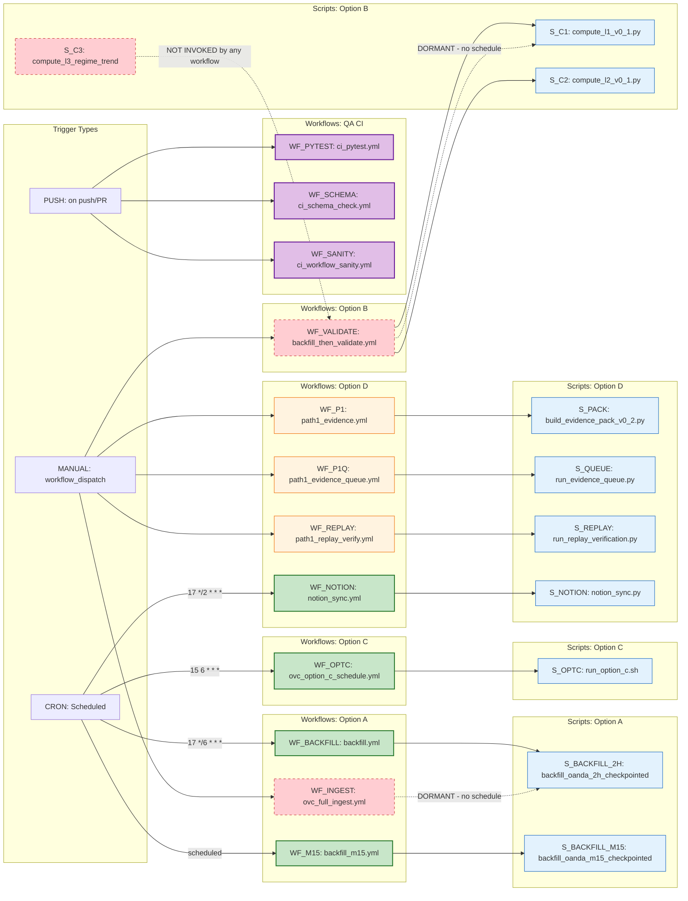

# Graph 12 — Overview: Orchestration

**Question:** Which workflows/scripts trigger which option processes?

## Legend

| Node ID | Description | Status |
|---------|-------------|--------|
| WF_BACKFILL | .github/workflows/backfill.yml | SCHEDULED (cron: 17 */6 * * *) |
| WF_M15 | .github/workflows/backfill_m15.yml | SCHEDULED |
| WF_INGEST | .github/workflows/ovc_full_ingest.yml | DORMANT (workflow_dispatch only) |
| WF_VALIDATE | .github/workflows/backfill_then_validate.yml | DORMANT (workflow_dispatch only) |
| WF_OPTC | .github/workflows/ovc_option_c_schedule.yml | SCHEDULED (cron: 15 6 * * *) |
| WF_P1 | .github/workflows/path1_evidence.yml | MANUAL |
| WF_P1Q | .github/workflows/path1_evidence_queue.yml | MANUAL |
| WF_REPLAY | .github/workflows/path1_replay_verify.yml | MANUAL |
| WF_NOTION | .github/workflows/notion_sync.yml | SCHEDULED (cron: 17 */2 * * *) |
| WF_PYTEST | .github/workflows/ci_pytest.yml | CI (on push/PR) |
| WF_SCHEMA | .github/workflows/ci_schema_check.yml | CI (on push/PR) |
| WF_SANITY | .github/workflows/ci_workflow_sanity.yml | CI (on push/PR) |
| S_BACKFILL_2H | src/backfill_oanda_2h_checkpointed.py | Active |
| S_BACKFILL_M15 | src/backfill_oanda_m15_checkpointed.py | Active |
| S_C1 | src/derived/compute_l1_v0_1.py | Active |
| S_C2 | src/derived/compute_l2_v0_1.py | Active |
| S_C3 | src/derived/compute_l3_regime_trend_v0_1.py | NOT INVOKED |
| S_OPTC | scripts/run/run_option_c.sh | Active |
| S_PACK | scripts/path1/build_evidence_pack_v0_2.py | Active |
| S_QUEUE | scripts/path1/run_evidence_queue.py | Active |
| S_REPLAY | scripts/path1_replay/run_replay_verification.py | Active |
| S_NOTION | scripts/export/notion_sync.py | Active |
