# Graph 20 — Option A Pipeline

**Question:** What are Option A's ingest pipelines and outputs?

```mermaid
%%─────────────────────────────────────────────────────────────────────────────
%% GRAPH 20 — OPTION A INTERNAL PIPELINE
%% Source: OPT_A__ORG_MAP_DRAFT.md
%%─────────────────────────────────────────────────────────────────────────────
flowchart TB

  %% Workflows
  subgraph WF[Workflows]
    WF_BACKFILL[WF_BACKFILL: backfill.yml<br/>cron: 17 */6 * * *]
    WF_M15[WF_M15: backfill_m15.yml]
    WF_INGEST[WF_INGEST: ovc_full_ingest.yml<br/>DORMANT]
  end

  %% Worker Subsystem
  subgraph WORKER[Worker Subsystem]
    W_INDEX[W_INDEX: index.ts]
    W_WRANGLER[W_WRANGLER: wrangler.jsonc]
  end

  %% Source Code
  subgraph SRC[src/ ingest code]
    S_BACKFILL_2H[S_BACKFILL_2H: backfill_oanda_2h_checkpointed.py]
    S_BACKFILL_M15[S_BACKFILL_M15: backfill_oanda_m15_checkpointed.py]
    S_INGEST[S_INGEST: ingest_history_day.py]
    S_TV_CSV[S_TV_CSV: history_sources/tv_csv.py]
  end

  %% SQL Schema
  subgraph SQL[sql/ schema]
    SQL_SCHEMA[SQL_SCHEMA: 00_schema.sql]
    SQL_TABLES[SQL_TABLES: 01_tables_min.sql]
  end

  %% Data
  subgraph DATA[data/]
    D_RAW[D_RAW: data/raw/tradingview/]
  end

  %% Outputs
  subgraph OUT[Canonical Outputs]
    O_BLOCKS[O_BLOCKS: ovc.ovc_blocks_v01_1_min]
    O_M15[O_M15: ovc.ovc_candles_m15_raw]
    O_R2[O_R2: R2 tv/YYYY-MM-DD/]
  end

  %% Workflow → Script
  WF_BACKFILL --> S_BACKFILL_2H
  WF_M15 --> S_BACKFILL_M15
  WF_INGEST -.->|DORMANT| S_INGEST

  %% Worker flows
  W_INDEX -->|upsert| O_BLOCKS
  W_INDEX -->|archive| O_R2
  W_WRANGLER -->|config| W_INDEX

  %% Script → Output
  S_BACKFILL_2H -->|upsert| O_BLOCKS
  S_BACKFILL_M15 -->|upsert| O_M15
  S_INGEST -->|CSV ingest| O_BLOCKS
  S_TV_CSV -->|read| S_INGEST

  %% Data → Script
  D_RAW -->|source| S_TV_CSV

  %% SQL → Output
  SQL_SCHEMA -->|defines| O_BLOCKS
  SQL_TABLES -->|defines| O_BLOCKS
  SQL_TABLES -->|defines| O_M15

  %% Styling
  classDef workflow fill:#fff3e0,stroke:#ef6c00,stroke-width:2px
  classDef canonical fill:#c8e6c9,stroke:#2e7d32,stroke-width:2px
  classDef dormant fill:#ffcdd2,stroke:#c62828,stroke-width:1px,stroke-dasharray:5
  classDef code fill:#e3f2fd,stroke:#1565c0,stroke-width:1px

  class WF_BACKFILL,WF_M15 workflow
  class WF_INGEST dormant
  class O_BLOCKS,O_M15 canonical
  class W_INDEX,W_WRANGLER,S_BACKFILL_2H,S_BACKFILL_M15,S_INGEST,S_TV_CSV,SQL_SCHEMA,SQL_TABLES,D_RAW,O_R2 code
```

## Legend

| Node ID | Full Path | Category |
|---------|-----------|----------|
| WF_BACKFILL | .github/workflows/backfill.yml | Orchestration |
| WF_M15 | .github/workflows/backfill_m15.yml | Orchestration |
| WF_INGEST | .github/workflows/ovc_full_ingest.yml | Orchestration (DORMANT) |
| W_INDEX | infra/ovc-webhook/src/index.ts | Sub-systems |
| W_WRANGLER | infra/ovc-webhook/wrangler.jsonc | Sub-systems |
| S_BACKFILL_2H | src/backfill_oanda_2h_checkpointed.py | Pipelines |
| S_BACKFILL_M15 | src/backfill_oanda_m15_checkpointed.py | Pipelines |
| S_INGEST | src/ingest_history_day.py | Pipelines |
| S_TV_CSV | src/history_sources/tv_csv.py | Data Stores |
| SQL_SCHEMA | sql/00_schema.sql | Data Stores |
| SQL_TABLES | sql/01_tables_min.sql | Data Stores |
| D_RAW | data/raw/tradingview/ | Data Stores |
| O_BLOCKS | ovc.ovc_blocks_v01_1_min | Data Stores (CANONICAL) |
| O_M15 | ovc.ovc_candles_m15_raw | Data Stores (CANONICAL) |
| O_R2 | R2 bucket: tv/YYYY-MM-DD/ | Data Stores |
