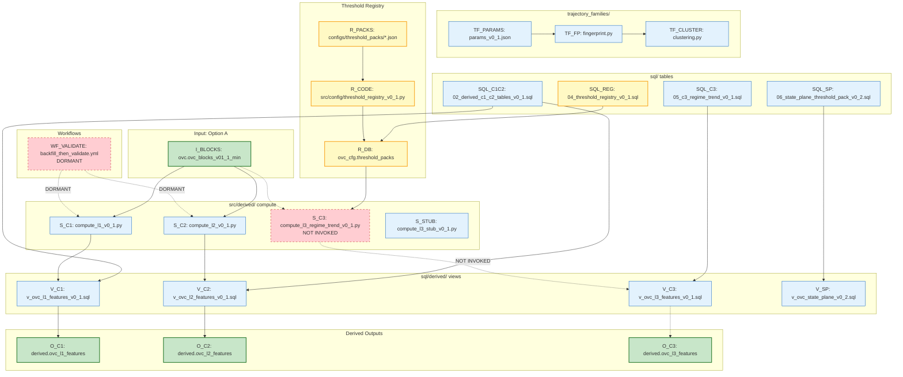

# Graph 21 — Option B Pipeline

**Question:** What are Option B's derived compute pipelines and outputs?

## Legend

| Node ID | Full Path | Category |
|---------|-----------|----------|
| WF_VALIDATE | .github/workflows/backfill_then_validate.yml | Orchestration (DORMANT) |
| I_BLOCKS | ovc.ovc_blocks_v01_1_min | Input (Option A) |
| S_C1 | src/derived/compute_l1_v0_1.py | Pipelines |
| S_C2 | src/derived/compute_l2_v0_1.py | Pipelines |
| S_C3 | src/derived/compute_l3_regime_trend_v0_1.py | Pipelines (NOT INVOKED) |
| S_STUB | src/derived/compute_l3_stub_v0_1.py | Pipelines |
| V_C1 | sql/derived/v_ovc_l1_features_v0_1.sql | Data Stores |
| V_C2 | sql/derived/v_ovc_l2_features_v0_1.sql | Data Stores |
| V_C3 | sql/derived/v_ovc_l3_features_v0_1.sql | Data Stores |
| V_SP | sql/derived/v_ovc_state_plane_v0_2.sql | Data Stores |
| TF_FP | trajectory_families/fingerprint.py | Models |
| TF_CLUSTER | trajectory_families/clustering.py | Models |
| TF_PARAMS | trajectory_families/params_v0_1.json | Models |
| R_PACKS | configs/threshold_packs/*.json | Registries |
| R_CODE | src/config/threshold_registry_v0_1.py | Registries |
| R_DB | ovc_cfg.threshold_packs | Registries |
| SQL_C1C2 | sql/02_derived_c1_c2_tables_v0_1.sql | Data Stores |
| SQL_C3 | sql/05_c3_regime_trend_v0_1.sql | Data Stores |
| SQL_REG | sql/04_threshold_registry_v0_1.sql | Registries |
| SQL_SP | sql/06_state_plane_threshold_pack_v0_2.sql | Data Stores |
| O_C1 | derived.ovc_l1_features | Data Stores (CANONICAL) |
| O_C2 | derived.ovc_l2_features | Data Stores (CANONICAL) |
| O_C3 | derived.ovc_l3_features | Data Stores (CANONICAL) |
