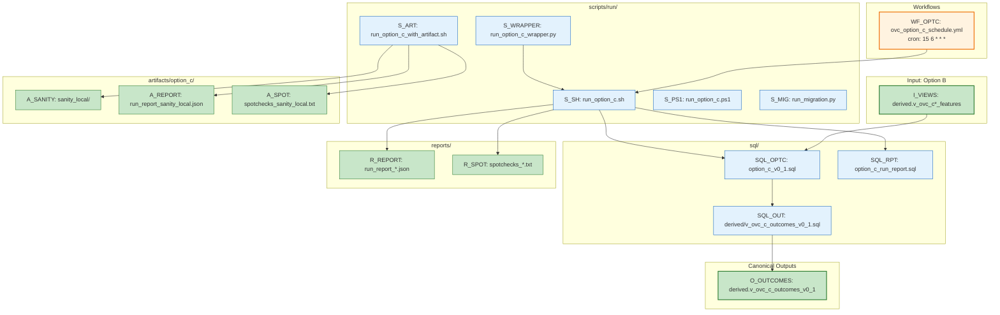

# Graph 22 — Option C Pipeline

**Question:** What are Option C's outcomes pipelines and outputs?

## Legend

| Node ID | Full Path | Category |
|---------|-----------|----------|
| WF_OPTC | .github/workflows/ovc_option_c_schedule.yml | Orchestration |
| I_VIEWS | derived.v_ovc_c*_features | Input (Option B) |
| S_SH | scripts/run/run_option_c.sh | Orchestration |
| S_PS1 | scripts/run/run_option_c.ps1 | Orchestration |
| S_WRAPPER | scripts/run/run_option_c_wrapper.py | Orchestration |
| S_ART | scripts/run/run_option_c_with_artifact.sh | Orchestration |
| S_MIG | scripts/run/run_migration.py | Orchestration |
| SQL_OPTC | sql/option_c_v0_1.sql | Data Stores |
| SQL_RPT | sql/option_c_run_report.sql | Data Stores |
| SQL_OUT | sql/derived/v_ovc_c_outcomes_v0_1.sql | Data Stores |
| A_SANITY | artifacts/option_c/sanity_local/ | Artifacts |
| A_REPORT | artifacts/option_c/run_report_sanity_local.json | Artifacts |
| A_SPOT | artifacts/option_c/spotchecks_sanity_local.txt | Artifacts |
| O_OUTCOMES | derived.v_ovc_c_outcomes_v0_1 | Data Stores (CANONICAL) |
| R_REPORT | reports/run_report_*.json | Artifacts |
| R_SPOT | reports/spotchecks_*.txt | Artifacts |
