# Graph 23 — Option D Pipeline

**Question:** What are Option D's Path1/bridge pipelines and outputs?

```mermaid
%%─────────────────────────────────────────────────────────────────────────────
%% GRAPH 23 — OPTION D INTERNAL PIPELINE
%% Source: OPT_D__ORG_MAP_DRAFT.md
%%─────────────────────────────────────────────────────────────────────────────
flowchart TB

  %% Workflows
  subgraph WF[Workflows]
    WF_P1[WF_P1: path1_evidence.yml]
    WF_P1Q[WF_P1Q: path1_evidence_queue.yml]
    WF_REPLAY[WF_REPLAY: path1_replay_verify.yml]
    WF_NOTION[WF_NOTION: notion_sync.yml<br/>cron: 17 */2 * * *]
  end

  %% Input
  subgraph INPUT[Input: Option C]
    I_OUTCOMES[I_OUTCOMES: derived.v_ovc_c_outcomes]
    I_TF[I_TF: trajectory_families/]
  end

  %% Path1 Scripts
  subgraph P1[scripts/path1/]
    S_PACK[S_PACK: build_evidence_pack_v0_2.py]
    S_QUEUE[S_QUEUE: run_evidence_queue.py]
    S_RANGE[S_RANGE: run_evidence_range.py]
    S_SP[S_SP: run_state_plane.py]
    S_TF[S_TF: run_trajectory_families.py]
    S_OVERLAY[S_OVERLAY: overlays_v0_3.py]
    S_GEN_Q[S_GEN_Q: generate_queue_resolved.py]
    S_POST[S_POST: validate_post_run.py]
  end

  %% Replay Scripts
  subgraph REPLAY[scripts/path1_replay/]
    S_REPLAY[S_REPLAY: run_replay_verification.py]
    S_REPLAY_LIB[S_REPLAY_LIB: lib.py]
  end

  %% Seal Scripts
  subgraph SEAL[scripts/path1_seal/]
    S_SEAL[S_SEAL: run_seal_manifests.py]
    S_SEAL_LIB[S_SEAL_LIB: lib.py]
  end

  %% Export Scripts
  subgraph EXPORT[scripts/export/]
    S_NOTION[S_NOTION: notion_sync.py]
    S_OANDA[S_OANDA: oanda_export_2h_day.py]
  end

  %% Ops
  subgraph OPS[src/ovc_ops/]
    S_ART[S_ART: run_artifact.py]
    S_ART_CLI[S_ART_CLI: run_artifact_cli.py]
  end

  %% SQL Path1
  subgraph SQL[sql/path1/]
    SQL_EV[SQL_EV: evidence/v_path1_evidence_*.sql]
    SQL_SC[SQL_SC: scores/score_*.sql]
    SQL_ST[SQL_ST: studies/*.sql]
    SQL_PATCH[SQL_PATCH: db_patches/patch_*.sql]
    SQL_RUNS[SQL_RUNS: evidence/runs/p1_*/]
  end

  %% Reports
  subgraph RPT[reports/]
    R_RUNS[R_RUNS: runs/run_id/]
    R_P1_EV[R_P1_EV: path1/evidence/runs/]
    R_P1_SC[R_P1_SC: path1/scores/]
    R_P1_TF[R_P1_TF: path1/trajectory_families/]
    R_QUEUE[R_QUEUE: path1/evidence/RUN_QUEUE.csv]
  end

  %% Workflow → Scripts
  WF_P1 --> S_PACK
  WF_P1Q --> S_QUEUE
  WF_REPLAY --> S_REPLAY
  WF_NOTION --> S_NOTION

  %% Input → Scripts
  I_OUTCOMES --> S_PACK
  I_TF --> S_TF

  %% P1 internal
  S_PACK --> SQL_EV
  S_PACK --> R_P1_EV
  S_QUEUE --> S_RANGE
  S_RANGE --> S_PACK
  S_GEN_Q --> R_QUEUE
  S_TF --> R_P1_TF

  %% Score flow
  SQL_SC --> R_P1_SC

  %% Replay flow
  S_REPLAY --> S_REPLAY_LIB
  S_REPLAY -.->|verify| R_P1_EV

  %% Seal flow
  S_SEAL --> S_SEAL_LIB

  %% Ops
  S_ART --> R_RUNS
  S_ART_CLI --> S_ART

  %% SQL runs
  S_PACK --> SQL_RUNS

  %% Export
  S_NOTION -->|sync| NOTION[NOTION: Notion DB]

  %% Styling
  classDef workflow fill:#fff3e0,stroke:#ef6c00,stroke-width:2px
  classDef canonical fill:#c8e6c9,stroke:#2e7d32,stroke-width:2px
  classDef code fill:#e3f2fd,stroke:#1565c0,stroke-width:1px
  classDef artifact fill:#c8e6c9,stroke:#2e7d32,stroke-width:1px
  classDef external fill:#e3f2fd,stroke:#1565c0,stroke-width:1px

  class WF_P1,WF_P1Q,WF_REPLAY,WF_NOTION workflow
  class I_OUTCOMES canonical
  class S_PACK,S_QUEUE,S_RANGE,S_SP,S_TF,S_OVERLAY,S_GEN_Q,S_POST,S_REPLAY,S_REPLAY_LIB,S_SEAL,S_SEAL_LIB,S_NOTION,S_OANDA,S_ART,S_ART_CLI code
  class SQL_EV,SQL_SC,SQL_ST,SQL_PATCH,SQL_RUNS code
  class R_RUNS,R_P1_EV,R_P1_SC,R_P1_TF,R_QUEUE artifact
  class NOTION,I_TF external
```

## Legend

| Node ID | Full Path | Category |
|---------|-----------|----------|
| WF_P1 | .github/workflows/path1_evidence.yml | Orchestration |
| WF_P1Q | .github/workflows/path1_evidence_queue.yml | Orchestration |
| WF_REPLAY | .github/workflows/path1_replay_verify.yml | Orchestration |
| WF_NOTION | .github/workflows/notion_sync.yml | Orchestration |
| I_OUTCOMES | derived.v_ovc_c_outcomes | Input (Option C) |
| I_TF | trajectory_families/ | Input (Option B) |
| S_PACK | scripts/path1/build_evidence_pack_v0_2.py | Orchestration |
| S_QUEUE | scripts/path1/run_evidence_queue.py | Orchestration |
| S_RANGE | scripts/path1/run_evidence_range.py | Orchestration |
| S_SP | scripts/path1/run_state_plane.py | Orchestration |
| S_TF | scripts/path1/run_trajectory_families.py | Orchestration |
| S_OVERLAY | scripts/path1/overlays_v0_3.py | Orchestration |
| S_GEN_Q | scripts/path1/generate_queue_resolved.py | Orchestration |
| S_POST | scripts/path1/validate_post_run.py | QA |
| S_REPLAY | scripts/path1_replay/run_replay_verification.py | QA |
| S_REPLAY_LIB | scripts/path1_replay/lib.py | Sub-systems |
| S_SEAL | scripts/path1_seal/run_seal_manifests.py | Orchestration |
| S_SEAL_LIB | scripts/path1_seal/lib.py | Sub-systems |
| S_NOTION | scripts/export/notion_sync.py | Orchestration |
| S_OANDA | scripts/export/oanda_export_2h_day.py | Orchestration |
| S_ART | src/ovc_ops/run_artifact.py | Orchestration |
| S_ART_CLI | src/ovc_ops/run_artifact_cli.py | Orchestration |
| SQL_EV | sql/path1/evidence/v_path1_evidence_*.sql | Data Stores |
| SQL_SC | sql/path1/scores/score_*.sql | Data Stores |
| SQL_ST | sql/path1/studies/*.sql | Experiments |
| SQL_PATCH | sql/path1/db_patches/patch_*.sql | Orchestration |
| SQL_RUNS | sql/path1/evidence/runs/p1_*/ | Artifacts |
| R_RUNS | reports/runs/run_id/ | Artifacts |
| R_P1_EV | reports/path1/evidence/runs/ | Artifacts |
| R_P1_SC | reports/path1/scores/ | Artifacts |
| R_P1_TF | reports/path1/trajectory_families/ | Artifacts |
| R_QUEUE | reports/path1/evidence/RUN_QUEUE.csv | Artifacts |
| NOTION | Notion databases | External |
