# Graph 24 — QA Pipeline

**Question:** What are QA's validation pipelines and outputs?

```mermaid
%%─────────────────────────────────────────────────────────────────────────────
%% GRAPH 24 — QA INTERNAL PIPELINE
%% Source: QA__ORG_MAP_DRAFT.md
%%─────────────────────────────────────────────────────────────────────────────
flowchart TB

  %% CI Workflows
  subgraph WF_CI[CI Workflows]
    WF_PYTEST[WF_PYTEST: ci_pytest.yml]
    WF_SCHEMA[WF_SCHEMA: ci_schema_check.yml]
    WF_SANITY[WF_SANITY: ci_workflow_sanity.yml]
  end

  %% Test Suite
  subgraph TESTS[tests/]
    T_DERIVED[T_DERIVED: test_derived_features.py]
    T_C3[T_C3: test_c3_regime_trend.py]
    T_CONTRACT[T_CONTRACT: test_contract_equivalence.py]
    T_MIN[T_MIN: test_min_contract_validation.py]
    T_REG[T_REG: test_threshold_registry.py]
    T_FP[T_FP: test_fingerprint.py]
    T_REPLAY[T_REPLAY: test_path1_replay_structural.py]
    T_FIX[T_FIX: fixtures/]
  end

  %% Validation Harness
  subgraph VAL[Validation Harness]
    V_DAY[V_DAY: src/validate_day.py]
    V_RANGE[V_RANGE: src/validate_range.py]
    V_DERIVED[V_DERIVED: src/validate/validate_derived_range_v0_1.py]
  end

  %% CI Scripts
  subgraph CI_SCR[scripts/ci/]
    CI_VERIFY[CI_VERIFY: verify_schema_objects.py]
  end

  %% Validation Scripts
  subgraph VAL_SCR[scripts/validate/]
    VAL_STATUS[VAL_STATUS: pipeline_status.py]
    VAL_PS1[VAL_PS1: validate_day.ps1]
  end

  %% QA SQL
  subgraph SQL[sql/ QA]
    SQL_QA[SQL_QA: qa_schema.sql]
    SQL_PACK[SQL_PACK: qa_validation_pack.sql]
    SQL_CORE[SQL_CORE: qa_validation_pack_core.sql]
    SQL_DRV[SQL_DRV: qa_validation_pack_derived.sql]
    SQL_GATE[SQL_GATE: 90_verify_gate2.sql<br/>NOT AUTOMATED]
    SQL_DERIVED[SQL_DERIVED: 03_qa_derived_validation_v0_1.sql]
  end

  %% Schema
  subgraph SCHEMA[schema/]
    SCH_MIG[SCH_MIG: applied_migrations.json<br/>ALL UNVERIFIED]
    SCH_OBJ[SCH_OBJ: required_objects.txt]
  end

  %% Contracts
  subgraph CONTRACTS[contracts/]
    C_EXPORT[C_EXPORT: export_contract_v0.1.1_min.json]
    C_DERIVED[C_DERIVED: derived_feature_set_v0.1.json]
    C_ARTIFACT[C_ARTIFACT: run_artifact_spec_v0.1.json]
    C_EVAL[C_EVAL: eval_contract_v0.1.json]
  end

  %% Tools
  subgraph TOOLS[tools/]
    TL_VAL[TL_VAL: validate_contract.py]
    TL_PARSE[TL_PARSE: parse_export.py]
    TL_MAZE[TL_MAZE: maze/gen_repo_maze*.py]
  end

  %% Artifacts
  subgraph ART[artifacts/]
    A_DERIVED[A_DERIVED: derived_validation/]
    A_REPLAY[A_REPLAY: path1_replay_report.json]
  end

  %% Reports
  subgraph RPT[reports/]
    R_VALID[R_VALID: validation/]
    R_VERIF[R_VERIF: verification/]
    R_AUDIT[R_AUDIT: pipeline_audit/]
  end

  %% Workflow → Tests
  WF_PYTEST --> TESTS
  WF_SCHEMA --> CI_VERIFY
  WF_SANITY -.->|checks| WF_CI

  %% Test → Contracts
  T_CONTRACT --> C_EXPORT
  T_DERIVED --> C_DERIVED
  T_MIN --> C_EXPORT
  T_FIX --> TESTS

  %% CI → Schema
  CI_VERIFY --> SCH_OBJ
  SCH_MIG -.->|UNVERIFIED| CI_VERIFY

  %% Validation flows
  V_DAY --> SQL_PACK
  V_RANGE --> SQL_PACK
  V_DERIVED --> SQL_DRV
  VAL_STATUS --> V_DAY

  %% SQL → Artifacts/Reports
  SQL_PACK --> R_VALID
  SQL_DRV --> A_DERIVED
  SQL_GATE -.->|NOT AUTOMATED| R_AUDIT
  SQL_DERIVED --> A_DERIVED

  %% Validation → Reports
  V_DAY --> R_VALID
  V_RANGE --> R_VALID
  V_DERIVED --> R_VALID

  %% Tools
  TL_VAL --> C_EXPORT

  %% Styling
  classDef workflow fill:#fff3e0,stroke:#ef6c00,stroke-width:2px
  classDef qaStyle fill:#e1bee7,stroke:#6a1b9a,stroke-width:2px
  classDef contract fill:#bbdefb,stroke:#1565c0,stroke-width:2px
  classDef notAutomated fill:#ffcdd2,stroke:#c62828,stroke-width:1px,stroke-dasharray:5
  classDef artifact fill:#c8e6c9,stroke:#2e7d32,stroke-width:1px

  class WF_PYTEST,WF_SCHEMA,WF_SANITY workflow
  class T_DERIVED,T_C3,T_CONTRACT,T_MIN,T_REG,T_FP,T_REPLAY,T_FIX,V_DAY,V_RANGE,V_DERIVED,CI_VERIFY,VAL_STATUS,VAL_PS1,SQL_QA,SQL_PACK,SQL_CORE,SQL_DRV,SQL_DERIVED,TL_VAL,TL_PARSE,TL_MAZE qaStyle
  class C_EXPORT,C_DERIVED,C_ARTIFACT,C_EVAL contract
  class SQL_GATE,SCH_MIG notAutomated
  class A_DERIVED,A_REPLAY,R_VALID,R_VERIF,R_AUDIT,SCH_OBJ artifact
```

## Legend

| Node ID | Full Path | Category |
|---------|-----------|----------|
| WF_PYTEST | .github/workflows/ci_pytest.yml | Orchestration |
| WF_SCHEMA | .github/workflows/ci_schema_check.yml | Orchestration |
| WF_SANITY | .github/workflows/ci_workflow_sanity.yml | Orchestration |
| T_DERIVED | tests/test_derived_features.py | QA |
| T_C3 | tests/test_c3_regime_trend.py | QA |
| T_CONTRACT | tests/test_contract_equivalence.py | QA |
| T_MIN | tests/test_min_contract_validation.py | QA |
| T_REG | tests/test_threshold_registry.py | QA |
| T_FP | tests/test_fingerprint.py | QA |
| T_REPLAY | tests/test_path1_replay_structural.py | QA |
| T_FIX | tests/fixtures/ | QA |
| V_DAY | src/validate_day.py | QA |
| V_RANGE | src/validate_range.py | QA |
| V_DERIVED | src/validate/validate_derived_range_v0_1.py | QA |
| CI_VERIFY | scripts/ci/verify_schema_objects.py | QA |
| VAL_STATUS | scripts/validate/pipeline_status.py | QA |
| VAL_PS1 | scripts/validate/validate_day.ps1 | QA |
| SQL_QA | sql/qa_schema.sql | Data Stores |
| SQL_PACK | sql/qa_validation_pack.sql | Data Stores |
| SQL_CORE | sql/qa_validation_pack_core.sql | Data Stores |
| SQL_DRV | sql/qa_validation_pack_derived.sql | Data Stores |
| SQL_GATE | sql/90_verify_gate2.sql | Data Stores (NOT AUTOMATED) |
| SQL_DERIVED | sql/03_qa_derived_validation_v0_1.sql | Data Stores |
| SCH_MIG | schema/applied_migrations.json | Registries (UNVERIFIED) |
| SCH_OBJ | schema/required_objects.txt | Registries |
| C_EXPORT | contracts/export_contract_v0.1.1_min.json | Contracts |
| C_DERIVED | contracts/derived_feature_set_v0.1.json | Contracts |
| C_ARTIFACT | contracts/run_artifact_spec_v0.1.json | Contracts |
| C_EVAL | contracts/eval_contract_v0.1.json | Contracts |
| TL_VAL | tools/validate_contract.py | QA |
| TL_PARSE | tools/parse_export.py | QA |
| TL_MAZE | tools/maze/gen_repo_maze*.py | Documentation |
| A_DERIVED | artifacts/derived_validation/ | Artifacts |
| A_REPLAY | artifacts/path1_replay_report.json | Artifacts |
| R_VALID | reports/validation/ | Artifacts |
| R_VERIF | reports/verification/ | Artifacts |
| R_AUDIT | reports/pipeline_audit/ | Artifacts |
