# Graph 30 — Contracts Map

**Question:** How are contracts organized and related?

```mermaid
%%─────────────────────────────────────────────────────────────────────────────
%% GRAPH 30 — CONTRACTS MAP
%% Source: QA__ORG_MAP_DRAFT.md, CATEGORY_PROCESS_APPENDIX_DRAFT.md
%%─────────────────────────────────────────────────────────────────────────────
flowchart TB

  %% Master Contract
  subgraph MASTER[Master Contract]
    C_MASTER[C_MASTER: A_TO_D_CONTRACT_v1.md]
  end

  %% Per-Option Contracts (docs/contracts/)
  subgraph MD_CONTRACTS[docs/contracts/]
    C_A[C_A: option_a_ingest_contract_v1.md]
    C_B[C_B: option_b_derived_contract_v1.md]
    C_C[C_C: option_c_outcomes_contract_v1.md]
    C_D[C_D: option_d_evidence_contract_v1.md]
    C_QA[C_QA: qa_validation_contract_v1.md]
  end

  %% Boundary Contracts
  subgraph BOUNDARY[Boundary Specs]
    B_INGEST[B_INGEST: ingest_boundary.md]
    B_DERIVED[B_DERIVED: derived_layer_boundary.md]
    B_CLAYER[B_CLAYER: c_layer_boundary_spec_v0.1.md]
    B_PATH2[B_PATH2: PATH2_CONTRACT_v1_0.md<br/>IMPLIED / NOT IMPLEMENTED]
  end

  %% JSON Contracts (contracts/)
  subgraph JSON_CONTRACTS[contracts/*.json]
    J_EXPORT_MIN[J_EXPORT_MIN: export_contract_v0.1.1_min.json<br/>52 fields - MIN immutable]
    J_EXPORT_FULL[J_EXPORT_FULL: export_contract_v0.1_full.json]
    J_DERIVED[J_DERIVED: derived_feature_set_v0.1.json]
    J_ARTIFACT[J_ARTIFACT: run_artifact_spec_v0.1.json]
    J_EVAL[J_EVAL: eval_contract_v0.1.json]
  end

  %% Governance
  subgraph GOV[Governance Docs]
    G_DOCTRINE[G_DOCTRINE: docs/doctrine/OVC_DOCTRINE.md]
    G_GATES[G_GATES: docs/doctrine/GATES.md]
    G_IMMUT[G_IMMUT: docs/doctrine/IMMUTABILITY_NOTICE.md]
    G_RULES[G_RULES: docs/governance/GOVERNANCE_RULES_v0.1.md]
    G_BRANCH[G_BRANCH: docs/governance/BRANCH_POLICY.md]
  end

  %% Master → Per-Option
  C_MASTER --> C_A
  C_MASTER --> C_B
  C_MASTER --> C_C
  C_MASTER --> C_D
  C_MASTER --> C_QA

  %% Per-Option → Boundary
  C_A --> B_INGEST
  C_B --> B_DERIVED
  C_C --> B_CLAYER
  C_D -.-> B_PATH2

  %% JSON linkages
  J_EXPORT_MIN --> C_A
  J_DERIVED --> C_B
  J_EVAL --> C_C
  J_ARTIFACT --> C_D

  %% Governance → Contracts
  G_DOCTRINE -.->|governs| MASTER
  G_DOCTRINE -.->|governs| MD_CONTRACTS
  G_IMMUT -.->|protects| J_EXPORT_MIN
  G_GATES -.->|defines| C_QA

  %% Styling
  classDef master fill:#ffecb3,stroke:#ff6f00,stroke-width:3px
  classDef contract fill:#bbdefb,stroke:#1565c0,stroke-width:2px
  classDef boundary fill:#e1bee7,stroke:#6a1b9a,stroke-width:1px
  classDef json fill:#c8e6c9,stroke:#2e7d32,stroke-width:2px
  classDef governance fill:#d1c4e9,stroke:#512da8,stroke-width:2px
  classDef notImpl fill:#ffcdd2,stroke:#c62828,stroke-width:1px,stroke-dasharray:5

  class C_MASTER master
  class C_A,C_B,C_C,C_D,C_QA contract
  class B_INGEST,B_DERIVED,B_CLAYER boundary
  class B_PATH2 notImpl
  class J_EXPORT_MIN,J_EXPORT_FULL,J_DERIVED,J_ARTIFACT,J_EVAL json
  class G_DOCTRINE,G_GATES,G_IMMUT,G_RULES,G_BRANCH governance
```

## Legend

| Node ID | Full Path | Owner |
|---------|-----------|-------|
| C_MASTER | docs/contracts/A_TO_D_CONTRACT_v1.md | Cross |
| C_A | docs/contracts/option_a_ingest_contract_v1.md | A |
| C_B | docs/contracts/option_b_derived_contract_v1.md | B |
| C_C | docs/contracts/option_c_outcomes_contract_v1.md | C |
| C_D | docs/contracts/option_d_evidence_contract_v1.md | D |
| C_QA | docs/contracts/qa_validation_contract_v1.md | QA |
| B_INGEST | docs/contracts/ingest_boundary.md | A |
| B_DERIVED | docs/contracts/derived_layer_boundary.md | B |
| B_CLAYER | docs/contracts/c_layer_boundary_spec_v0.1.md | C |
| B_PATH2 | docs/contracts/PATH2_CONTRACT_v1_0.md | Cross (NOT IMPLEMENTED) |
| J_EXPORT_MIN | contracts/export_contract_v0.1.1_min.json | D |
| J_EXPORT_FULL | contracts/export_contract_v0.1_full.json | D |
| J_DERIVED | contracts/derived_feature_set_v0.1.json | B |
| J_ARTIFACT | contracts/run_artifact_spec_v0.1.json | D |
| J_EVAL | contracts/eval_contract_v0.1.json | C |
| G_DOCTRINE | docs/doctrine/OVC_DOCTRINE.md | QA |
| G_GATES | docs/doctrine/GATES.md | QA |
| G_IMMUT | docs/doctrine/IMMUTABILITY_NOTICE.md | QA |
| G_RULES | docs/governance/GOVERNANCE_RULES_v0.1.md | QA |
| G_BRANCH | docs/governance/BRANCH_POLICY.md | QA |
