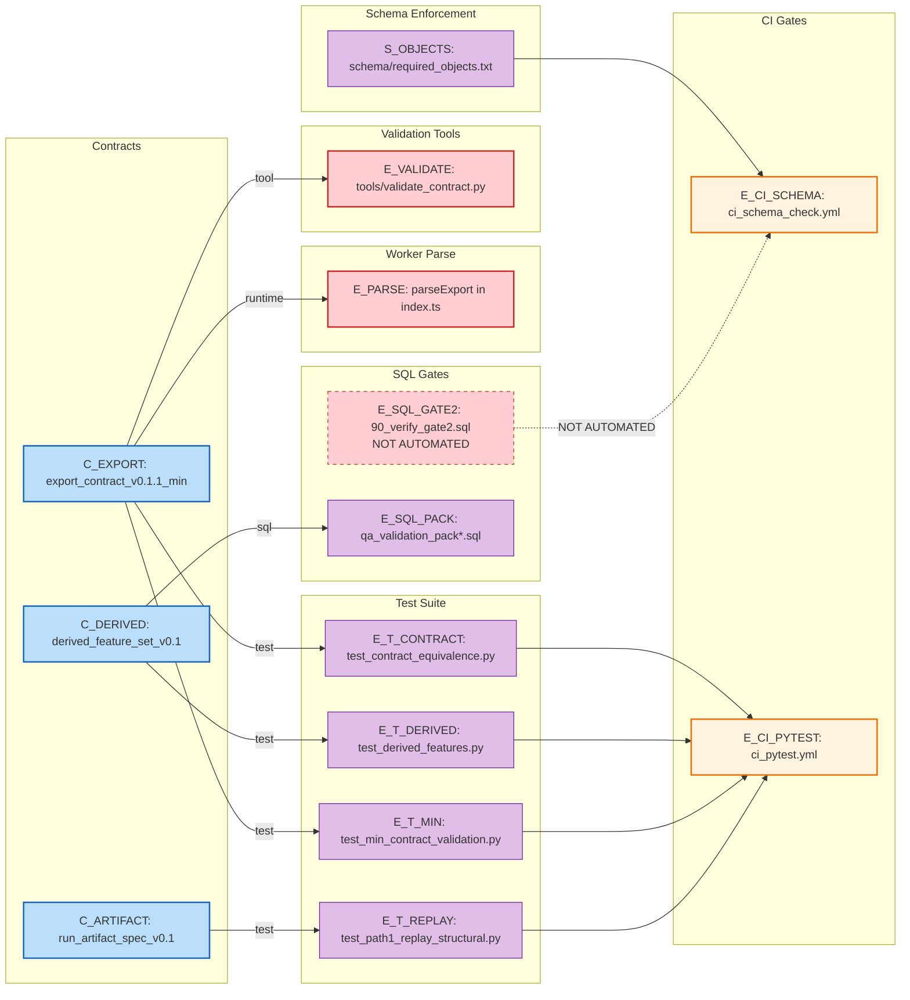

# Graph 31 — Enforcement Points

**Question:** Where are contracts validated in the system?

## Enforcement Matrix

| Contract | Enforcement Point | Type | Status |
|----------|-------------------|------|--------|
| export_contract_v0.1.1_min.json | Worker parseExport | Runtime | Active |
| export_contract_v0.1.1_min.json | test_contract_equivalence.py | Test | Active |
| export_contract_v0.1.1_min.json | test_min_contract_validation.py | Test | Active |
| export_contract_v0.1.1_min.json | tools/validate_contract.py | Tool | Active |
| derived_feature_set_v0.1.json | test_derived_features.py | Test | Active |
| derived_feature_set_v0.1.json | qa_validation_pack*.sql | SQL | Active |
| run_artifact_spec_v0.1.json | test_path1_replay_structural.py | Test | Active |
| (all) | ci_pytest.yml | CI | Active |
| (schema) | ci_schema_check.yml | CI | Active |
| (schema) | 90_verify_gate2.sql | SQL | NOT AUTOMATED |

## Legend

| Node ID | Full Path |
|---------|-----------|
| C_EXPORT | contracts/export_contract_v0.1.1_min.json |
| C_DERIVED | contracts/derived_feature_set_v0.1.json |
| C_ARTIFACT | contracts/run_artifact_spec_v0.1.json |
| E_PARSE | infra/ovc-webhook/src/index.ts (parseExport function) |
| E_T_CONTRACT | tests/test_contract_equivalence.py |
| E_T_DERIVED | tests/test_derived_features.py |
| E_T_MIN | tests/test_min_contract_validation.py |
| E_T_REPLAY | tests/test_path1_replay_structural.py |
| E_CI_SCHEMA | .github/workflows/ci_schema_check.yml |
| E_CI_PYTEST | .github/workflows/ci_pytest.yml |
| E_SQL_GATE2 | sql/90_verify_gate2.sql |
| E_SQL_PACK | sql/qa_validation_pack*.sql |
| E_VALIDATE | tools/validate_contract.py |
| S_OBJECTS | schema/required_objects.txt |
