# Graph 40 — Artifact Lifecycle

**Question:** How do artifacts flow from runs to evidence packs to reports?

```mermaid
%%─────────────────────────────────────────────────────────────────────────────
%% GRAPH 40 — ARTIFACT LIFECYCLE
%% Source: OPT_D__ORG_MAP_DRAFT.md, CATEGORY_PROCESS_APPENDIX_DRAFT.md
%%─────────────────────────────────────────────────────────────────────────────
flowchart TB

  %% Producers
  subgraph PROD[Pipeline Producers]
    P_BACKFILL[P_BACKFILL: backfill_*.py]
    P_DERIVED[P_DERIVED: compute_c*.py]
    P_OPTC[P_OPTC: run_option_c.sh]
    P_PATH1[P_PATH1: build_evidence_pack_v0_2.py]
    P_TF[P_TF: run_trajectory_families.py]
  end

  %% Run Artifact System
  subgraph RUN_SYS[Run Artifact System]
    RA_CODE[RA_CODE: src/ovc_ops/run_artifact.py]
    RA_CLI[RA_CLI: run_artifact_cli.py]
    RA_SPEC[RA_SPEC: run_artifact_spec_v0.1.json]
  end

  %% Run Artifacts
  subgraph RUNS[reports/runs/]
    RUN_JSON[RUN_JSON: run.json]
    RUN_LOG[RUN_LOG: run.log]
    RUN_CHECKS[RUN_CHECKS: checks.json]
  end

  %% Evidence Packs
  subgraph EVIDENCE[reports/path1/evidence/]
    EV_RUNS[EV_RUNS: runs/p1_*/]
    EV_RUN_MD[EV_RUN_MD: RUN.md]
    EV_DIS[EV_DIS: DIS_v1_1_evidence.md]
    EV_LID[EV_LID: LID_v1_0_evidence.md]
    EV_RES[EV_RES: RES_v1_0_evidence.md]
    EV_OUT[EV_OUT: outputs/]
    EV_QUEUE[EV_QUEUE: RUN_QUEUE.csv]
  end

  %% Scores
  subgraph SCORES[reports/path1/scores/]
    SC_DIS[SC_DIS: DIS_v1_1.md]
    SC_LID[SC_LID: LID_v1_0.md]
    SC_RES[SC_RES: RES_v1_0.md]
  end

  %% Trajectory Families
  subgraph TF_OUT[reports/path1/trajectory_families/]
    TF_V01[TF_V01: v0.1/]
    TF_FP[TF_FP: fingerprints/]
    TF_INDEX[TF_INDEX: index.csv]
  end

  %% Option C Artifacts
  subgraph OPTC_ART[artifacts/option_c/]
    AC_SANITY[AC_SANITY: sanity_local/]
    AC_RPT[AC_RPT: run_report_sanity_local.json]
    AC_SPOT[AC_SPOT: spotchecks_sanity_local.txt]
  end

  %% Derived Validation
  subgraph DV_ART[artifacts/derived_validation/]
    DV_RUNS[DV_RUNS: run_id/]
    DV_META[DV_META: meta.json]
    DV_DATA[DV_DATA: derived_validation_*.jsonl]
    DV_LATEST[DV_LATEST: LATEST.txt]
  end

  %% SQL Artifacts
  subgraph SQL_ART[sql/path1/evidence/runs/]
    SQL_SNAP[SQL_SNAP: p1_*/]
  end

  %% Producer → Run Artifact System
  P_BACKFILL --> RA_CODE
  P_DERIVED --> RA_CODE
  P_PATH1 --> RA_CODE

  %% Run Artifact System → Outputs
  RA_CODE --> RUN_JSON
  RA_CODE --> RUN_LOG
  RA_CODE --> RUN_CHECKS
  RA_SPEC -.->|schema| RA_CODE

  %% Path1 flows
  P_PATH1 --> EV_RUNS
  EV_RUNS --> EV_RUN_MD
  EV_RUNS --> EV_DIS
  EV_RUNS --> EV_LID
  EV_RUNS --> EV_RES
  EV_RUNS --> EV_OUT
  P_PATH1 --> SQL_SNAP

  %% Scores
  P_PATH1 --> SC_DIS
  P_PATH1 --> SC_LID
  P_PATH1 --> SC_RES

  %% TF
  P_TF --> TF_V01
  TF_V01 --> TF_FP
  TF_FP --> TF_INDEX

  %% Option C
  P_OPTC --> AC_SANITY
  AC_SANITY --> AC_RPT
  AC_SANITY --> AC_SPOT

  %% Derived validation
  P_DERIVED --> DV_RUNS
  DV_RUNS --> DV_META
  DV_RUNS --> DV_DATA
  DV_DATA --> DV_LATEST

  %% Styling
  classDef producer fill:#fff3e0,stroke:#ef6c00,stroke-width:2px
  classDef artifact fill:#c8e6c9,stroke:#2e7d32,stroke-width:1px
  classDef system fill:#e3f2fd,stroke:#1565c0,stroke-width:2px
  classDef contract fill:#bbdefb,stroke:#1565c0,stroke-width:2px

  class P_BACKFILL,P_DERIVED,P_OPTC,P_PATH1,P_TF producer
  class RUN_JSON,RUN_LOG,RUN_CHECKS,EV_RUNS,EV_RUN_MD,EV_DIS,EV_LID,EV_RES,EV_OUT,EV_QUEUE,SC_DIS,SC_LID,SC_RES,TF_V01,TF_FP,TF_INDEX,AC_SANITY,AC_RPT,AC_SPOT,DV_RUNS,DV_META,DV_DATA,DV_LATEST,SQL_SNAP artifact
  class RA_CODE,RA_CLI system
  class RA_SPEC contract
```

## Legend

| Node ID | Full Path | Category |
|---------|-----------|----------|
| P_BACKFILL | src/backfill_*.py | Pipelines |
| P_DERIVED | src/derived/compute_c*.py | Pipelines |
| P_OPTC | scripts/run/run_option_c.sh | Orchestration |
| P_PATH1 | scripts/path1/build_evidence_pack_v0_2.py | Orchestration |
| P_TF | scripts/path1/run_trajectory_families.py | Orchestration |
| RA_CODE | src/ovc_ops/run_artifact.py | Sub-systems |
| RA_CLI | src/ovc_ops/run_artifact_cli.py | Sub-systems |
| RA_SPEC | contracts/run_artifact_spec_v0.1.json | Contracts |
| RUN_JSON | reports/runs/run_id/run.json | Artifacts |
| RUN_LOG | reports/runs/run_id/run.log | Artifacts |
| RUN_CHECKS | reports/runs/run_id/checks.json | Artifacts |
| EV_RUNS | reports/path1/evidence/runs/p1_*/ | Artifacts |
| EV_RUN_MD | reports/path1/evidence/runs/p1_*/RUN.md | Artifacts |
| EV_DIS | reports/path1/evidence/runs/p1_*/DIS_v1_1_evidence.md | Artifacts |
| EV_LID | reports/path1/evidence/runs/p1_*/LID_v1_0_evidence.md | Artifacts |
| EV_RES | reports/path1/evidence/runs/p1_*/RES_v1_0_evidence.md | Artifacts |
| EV_OUT | reports/path1/evidence/runs/p1_*/outputs/ | Artifacts |
| EV_QUEUE | reports/path1/evidence/RUN_QUEUE.csv | Artifacts |
| SC_DIS | reports/path1/scores/DIS_v1_1.md | Artifacts |
| SC_LID | reports/path1/scores/LID_v1_0.md | Artifacts |
| SC_RES | reports/path1/scores/RES_v1_0.md | Artifacts |
| TF_V01 | reports/path1/trajectory_families/v0.1/ | Artifacts |
| TF_FP | reports/path1/trajectory_families/v0.1/fingerprints/ | Artifacts |
| TF_INDEX | reports/path1/trajectory_families/v0.1/fingerprints/index.csv | Artifacts |
| AC_SANITY | artifacts/option_c/sanity_local/ | Artifacts |
| AC_RPT | artifacts/option_c/run_report_sanity_local.json | Artifacts |
| AC_SPOT | artifacts/option_c/spotchecks_sanity_local.txt | Artifacts |
| DV_RUNS | artifacts/derived_validation/run_id/ | Artifacts |
| DV_META | artifacts/derived_validation/run_id/meta.json | Artifacts |
| DV_DATA | artifacts/derived_validation/run_id/*.jsonl | Artifacts |
| DV_LATEST | artifacts/derived_validation/LATEST.txt | Artifacts |
| SQL_SNAP | sql/path1/evidence/runs/p1_*/ | Artifacts |
