# Graph 41 — Validation Chain

**Question:** How does validation produce audit artifacts and verification reports?

```mermaid
%%─────────────────────────────────────────────────────────────────────────────
%% GRAPH 41 — VALIDATION CHAIN
%% Source: QA__ORG_MAP_DRAFT.md, CATEGORY_PROCESS_APPENDIX_DRAFT.md
%%─────────────────────────────────────────────────────────────────────────────
flowchart TB

  %% Validation Inputs
  subgraph INPUTS[Validation Inputs]
    I_BLOCKS[I_BLOCKS: ovc.ovc_blocks_v01_1_min]
    I_DERIVED[I_DERIVED: derived.ovc_c*_features]
    I_OUTCOMES[I_OUTCOMES: derived.v_ovc_c_outcomes]
    I_EVIDENCE[I_EVIDENCE: reports/path1/evidence/runs/]
  end

  %% Validation Harness
  subgraph VAL_HARNESS[Validation Harness]
    V_DAY[V_DAY: src/validate_day.py]
    V_RANGE[V_RANGE: src/validate_range.py]
    V_DERIVED[V_DERIVED: validate_derived_range_v0_1.py]
  end

  %% SQL Validation
  subgraph SQL_VAL[SQL Validation]
    SQ_PACK[SQ_PACK: qa_validation_pack.sql]
    SQ_CORE[SQ_CORE: qa_validation_pack_core.sql]
    SQ_DRV[SQ_DRV: qa_validation_pack_derived.sql]
    SQ_GATE[SQ_GATE: 90_verify_gate2.sql<br/>NOT AUTOMATED]
  end

  %% Replay Verification
  subgraph REPLAY[Replay Verification]
    R_SCRIPT[R_SCRIPT: run_replay_verification.py]
    R_LIB[R_LIB: scripts/path1_replay/lib.py]
  end

  %% Validation Reports
  subgraph VAL_RPT[reports/validation/]
    RPT_C1[RPT_C1: C1_v0_1_validation.md]
    RPT_C2[RPT_C2: C2_v0_1_validation.md]
    RPT_C3[RPT_C3: C3_v0_1_validation.md]
    RPT_RANGE[RPT_RANGE: validate_range_*]
  end

  %% Verification Reports
  subgraph VERIF_RPT[reports/verification/]
    VF_DATE[VF_DATE: 2026-01-19/]
    VF_ANCHOR[VF_ANCHOR: EVIDENCE_ANCHOR_v0_1.md]
    VF_REPRO[VF_REPRO: REPRO_REPORT_*]
  end

  %% Audit Reports
  subgraph AUDIT_RPT[reports/pipeline_audit/]
    AU_DATE[AU_DATE: 2026-01-19/]
  end

  %% Derived Validation Artifacts
  subgraph DV_ART[artifacts/derived_validation/]
    DV_RUN[DV_RUN: run_id/]
    DV_LATEST[DV_LATEST: LATEST.txt]
  end

  %% Replay Artifacts
  subgraph REPLAY_ART[Replay Artifacts]
    RA_RPT[RA_RPT: artifacts/path1_replay_report.json]
  end

  %% Verification Private Data
  subgraph PRIV[data/verification_private/]
    VP_DATE[VP_DATE: 2026-01-19/]
    VP_CMD[VP_CMD: commands_run.txt]
    VP_OUT[VP_OUT: outputs/]
  end

  %% Input → Validation
  I_BLOCKS --> V_DAY
  I_BLOCKS --> V_RANGE
  I_DERIVED --> V_DERIVED
  I_DERIVED --> SQ_DRV
  I_OUTCOMES --> V_RANGE
  I_EVIDENCE --> R_SCRIPT

  %% Validation → SQL
  V_DAY --> SQ_PACK
  V_RANGE --> SQ_PACK
  V_DERIVED --> SQ_DRV

  %% Validation → Reports
  V_DAY --> RPT_RANGE
  V_RANGE --> RPT_RANGE
  V_DERIVED --> RPT_C1
  V_DERIVED --> RPT_C2
  V_DERIVED --> RPT_C3

  %% Validation → Artifacts
  V_DERIVED --> DV_RUN
  DV_RUN --> DV_LATEST

  %% Replay flows
  R_SCRIPT --> R_LIB
  R_SCRIPT --> RA_RPT
  R_SCRIPT --> VF_REPRO

  %% SQL to audit (not automated)
  SQ_GATE -.->|NOT AUTOMATED| AU_DATE

  %% Verification reports
  VP_DATE --> VP_CMD
  VP_DATE --> VP_OUT
  VP_OUT --> VF_DATE
  VF_DATE --> VF_ANCHOR

  %% Cross-links
  RPT_RANGE --> AU_DATE
  DV_RUN --> RPT_C1

  %% Styling
  classDef input fill:#c8e6c9,stroke:#2e7d32,stroke-width:2px
  classDef validation fill:#e1bee7,stroke:#6a1b9a,stroke-width:2px
  classDef sql fill:#e3f2fd,stroke:#1565c0,stroke-width:1px
  classDef report fill:#fff3e0,stroke:#ef6c00,stroke-width:1px
  classDef artifact fill:#c8e6c9,stroke:#2e7d32,stroke-width:1px
  classDef notAutomated fill:#ffcdd2,stroke:#c62828,stroke-width:1px,stroke-dasharray:5

  class I_BLOCKS,I_DERIVED,I_OUTCOMES,I_EVIDENCE input
  class V_DAY,V_RANGE,V_DERIVED,R_SCRIPT,R_LIB validation
  class SQ_PACK,SQ_CORE,SQ_DRV sql
  class SQ_GATE notAutomated
  class RPT_C1,RPT_C2,RPT_C3,RPT_RANGE,VF_DATE,VF_ANCHOR,VF_REPRO,AU_DATE report
  class DV_RUN,DV_LATEST,RA_RPT,VP_DATE,VP_CMD,VP_OUT artifact
```

## Validation Chain Summary

| Stage | Input | Process | Output |
|-------|-------|---------|--------|
| Day Validation | ovc_blocks | validate_day.py | reports/validation/validate_range_* |
| Range Validation | ovc_blocks + outcomes | validate_range.py | reports/validation/validate_range_* |
| Derived Validation | derived features | validate_derived_range_v0_1.py | C1/C2/C3 validation reports |
| Replay Verification | evidence runs | run_replay_verification.py | path1_replay_report.json |
| Gate Verification | schema objects | 90_verify_gate2.sql | (NOT AUTOMATED) |

## Legend

| Node ID | Full Path |
|---------|-----------|
| I_BLOCKS | ovc.ovc_blocks_v01_1_min |
| I_DERIVED | derived.ovc_c*_features |
| I_OUTCOMES | derived.v_ovc_c_outcomes_v0_1 |
| I_EVIDENCE | reports/path1/evidence/runs/ |
| V_DAY | src/validate_day.py |
| V_RANGE | src/validate_range.py |
| V_DERIVED | src/validate/validate_derived_range_v0_1.py |
| SQ_PACK | sql/qa_validation_pack.sql |
| SQ_CORE | sql/qa_validation_pack_core.sql |
| SQ_DRV | sql/qa_validation_pack_derived.sql |
| SQ_GATE | sql/90_verify_gate2.sql |
| R_SCRIPT | scripts/path1_replay/run_replay_verification.py |
| R_LIB | scripts/path1_replay/lib.py |
| RPT_C1 | reports/validation/C1_v0_1_validation.md |
| RPT_C2 | reports/validation/C2_v0_1_validation.md |
| RPT_C3 | reports/validation/C3_v0_1_validation.md |
| RPT_RANGE | reports/validation/validate_range_* |
| VF_DATE | reports/verification/2026-01-19/ |
| VF_ANCHOR | reports/verification/EVIDENCE_ANCHOR_v0_1.md |
| VF_REPRO | reports/verification/REPRO_REPORT_* |
| AU_DATE | reports/pipeline_audit/2026-01-19/ |
| DV_RUN | artifacts/derived_validation/run_id/ |
| DV_LATEST | artifacts/derived_validation/LATEST.txt |
| RA_RPT | artifacts/path1_replay_report.json |
| VP_DATE | data/verification_private/2026-01-19/ |
| VP_CMD | data/verification_private/2026-01-19/commands_run.txt |
| VP_OUT | data/verification_private/2026-01-19/outputs/ |
