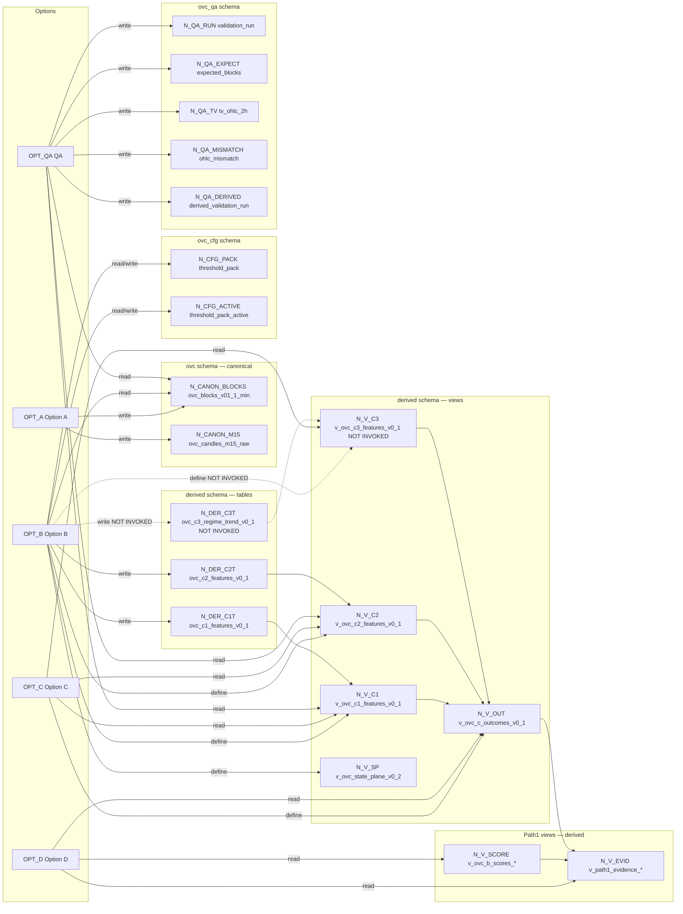

# Graph 50 — Neon Schema Topology

**Question:** What canonical tables/views/config tables exist in Neon, and which options read/write them?

## Legend

| Node ID        | Full name / notes                                                                                                                                                       |
| -------------- | ----------------------------------------------------------------------------------------------------------------------------------------------------------------------- |
| OPT_A          | Option A (canonical ingest)                                                                                                                                             |
| OPT_B          | Option B (derived features)                                                                                                                                             |
| OPT_C          | Option C (outcomes)                                                                                                                                                     |
| OPT_D          | Option D (Path1/bridge)                                                                                                                                                 |
| OPT_QA         | QA (validation/governance)                                                                                                                                              |
| N_CANON_BLOCKS | ovc.ovc_blocks_v01_1_min (sql/01_tables_min.sql)                                                                                                                        |
| N_CANON_M15    | ovc.ovc_candles_m15_raw (sql/path1/db_patches/patch_m15_raw_20260122.sql)                                                                                               |
| N_DER_C1T      | derived.ovc_c1_features_v0_1 (sql/02_derived_c1_c2_tables_v0_1.sql)                                                                                                     |
| N_DER_C2T      | derived.ovc_c2_features_v0_1 (sql/02_derived_c1_c2_tables_v0_1.sql)                                                                                                     |
| N_DER_C3T      | derived.ovc_c3_regime_trend_v0_1 (sql/05_c3_regime_trend_v0_1.sql) (NOT INVOKED)                                                                                        |
| N_V_C1         | derived.v_ovc_c1_features_v0_1 (sql/derived/v_ovc_c1_features_v0_1.sql)                                                                                                 |
| N_V_C2         | derived.v_ovc_c2_features_v0_1 (sql/derived/v_ovc_c2_features_v0_1.sql)                                                                                                 |
| N_V_C3         | derived.v_ovc_c3_features_v0_1 (sql/derived/v_ovc_c3_features_v0_1.sql) (NOT INVOKED)                                                                                   |
| N_V_SP         | derived.v_ovc_state_plane_v0_2 (sql/derived/v_ovc_state_plane_v0_2.sql)                                                                                                 |
| N_V_OUT        | derived.v_ovc_c_outcomes_v0_1 (sql/derived/v_ovc_c_outcomes_v0_1.sql)                                                                                                   |
| N_CFG_PACK     | ovc_cfg.threshold_pack (sql/04_threshold_registry_v0_1.sql)                                                                                                             |
| N_CFG_ACTIVE   | ovc_cfg.threshold_pack_active (sql/04_threshold_registry_v0_1.sql)                                                                                                      |
| N_QA_RUN       | ovc_qa.validation_run (sql/qa_schema.sql)                                                                                                                               |
| N_QA_EXPECT    | ovc_qa.expected_blocks (sql/qa_schema.sql)                                                                                                                              |
| N_QA_TV        | ovc_qa.tv_ohlc_2h (sql/qa_schema.sql)                                                                                                                                   |
| N_QA_MISMATCH  | ovc_qa.ohlc_mismatch (sql/qa_schema.sql)                                                                                                                                |
| N_QA_DERIVED   | ovc_qa.derived_validation_run (sql/03_qa_derived_validation_v0_1.sql)                                                                                                   |
| N_V_SCORE      | derived.v_ovc_b_scores_dis_v1_1; derived.v_ovc_b_scores_res_v1_0; derived.v_ovc_b_scores_lid_v1_0 (sql/path1/db_patches/patch_create_score_views_20260120.sql)          |
| N_V_EVID       | derived.v_path1_evidence_dis_v1_1; derived.v_path1_evidence_res_v1_0; derived.v_path1_evidence_lid_v1_0 (sql/path1/db_patches/patch_create_evidence_views_20260120.sql) |

