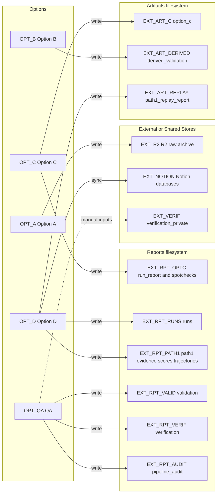

# Graph 51 — External Stores

**Question:** What external stores exist and what writes/reads them?

## Legend

| Node ID         | Full name / notes |
|-----------------|-------------------|
| OPT_A           | Option A (canonical ingest) |
| OPT_B           | Option B (derived features) |
| OPT_C           | Option C (outcomes) |
| OPT_D           | Option D (Path1/bridge) |
| OPT_QA          | QA (validation/governance) |
| EXT_R2          | R2 raw archive (Option A writes reports in tv/YYYY-MM-DD/ partition) |
| EXT_NOTION      | Notion databases (sync target) |
| EXT_VERIF       | data/verification_private/ (local/private verification store) |
| EXT_ART_C       | artifacts/option_c/ |
| EXT_ART_DERIVED | artifacts/derived_validation/ |
| EXT_ART_REPLAY  | artifacts/path1_replay_report.json |
| EXT_RPT_OPTC    | reports/run_report_*.json; reports/spotchecks_*.txt |
| EXT_RPT_RUNS    | reports/runs/run_id/ |
| EXT_RPT_PATH1   | reports/path1/evidence/; reports/path1/scores/; reports/path1/trajectory_families/ |
| EXT_RPT_VALID   | reports/validation/ |
| EXT_RPT_VERIF   | reports/verification/ |
| EXT_RPT_AUDIT   | reports/pipeline_audit/ |

