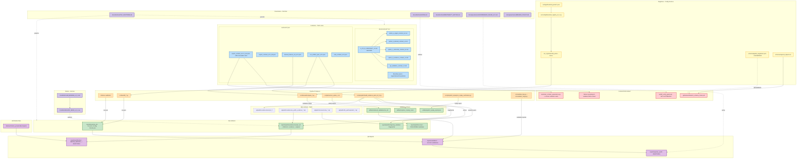

# Artifact & Contract Flow Graph

```mermaid
%%─────────────────────────────────────────────────────────────────────────────
%% GRAPH 3 — ARTIFACT & CONTRACT FLOW GRAPH (BOX FORM)
%% Source: CATEGORY_PROCESS_APPENDIX_DRAFT.md, OPT_*__ORG_MAP_DRAFT.md
%%─────────────────────────────────────────────────────────────────────────────
flowchart TB

  %% Contracts
  subgraph CONTRACTS[Contracts - Truth Locks]
    direction TB
    subgraph JSONC[contracts/*.json]
      C_export_min[export_contract_v0.1.1_min.json - MIN immutable claim]
      C_export_full[export_contract_v0.1_full.json]
      C_derived[derived_feature_set_v0.1.json]
      C_artifact[run_artifact_spec_v0.1.json]
      C_eval[eval_contract_v0.1.json]
    end
    subgraph MDC[docs/contracts/*.md]
      C_A[option_a_ingest_contract_v1.md]
      C_B[option_b_derived_contract_v1.md]
      C_C[option_c_outcomes_contract_v1.md]
      C_D[option_d_evidence_contract_v1.md]
      C_QA[qa_validation_contract_v1.md]
      C_MASTER[A_TO_D_CONTRACT_v1.md - MASTER]
      C_BOUNDARY[Boundary specs - ingest/derived boundaries]
    end
  end

  %% Registries
  subgraph REG[Registries - Config Sources]
    direction TB
    R_thresh_files[configs/threshold_packs/*.json]
    R_thresh_code[src/config/threshold_registry_v0_1.py]
    R_thresh_db[ovc_cfg.threshold_packs - Neon]
    R_migrations[schema/applied_migrations.json - UNVERIFIED]
    R_objects[schema/required_objects.txt]
  end

  %% Producers
  subgraph PROD[Pipeline Producers]
    direction TB
    P_worker[infra/ovc-webhook]
    P_backfill[src/backfill_*.py]
    P_derived[src/derived/compute_*.py]
    P_option_c[scripts/run/run_option_c.sh]
    P_path1[scripts/path1/build_evidence_pack_v0_2.py]
    P_replay[scripts/path1_replay/run_replay_verification.py]
    P_validate[src/validate_day.py + src/validate_range.py]
  end

  %% Run artifacts
  subgraph RUNS[Run Artifacts]
    direction TB
    A_runs[reports/runs/run_id/ - run.json, run.log, checks.json]
    A_p1_evidence[reports/path1/evidence/runs/p1_id/ - RUN.md + evidence + outputs/]
    A_p1_scores[reports/path1/scores/ - DIS/LID/RES markdown]
    A_p1_tf[reports/path1/trajectory_families/ - fingerprints]
  end

  %% Validation artifacts
  subgraph VALA[Validation Artifacts]
    direction TB
    A_derived_val[artifacts/derived_validation/run_id/]
    A_option_c[artifacts/option_c/sanity_local/]
    A_replay[artifacts/path1_replay_report.json]
  end

  %% QA reports
  subgraph QAR[QA Reports]
    direction TB
    R_valid[reports/validation/ - L1/L2/L3 validations]
    R_verif[reports/verification/ - REPRO_REPORT_*, dated folders]
    R_audit[reports/pipeline_audit/ - dated folders]
  end

  %% Verification data
  subgraph VDATA[Verification Data]
    V_private[data/verification_private/date/outputs/]
  end

  %% SQL artifacts (Path1)
  subgraph SQLP1[SQL Artifacts - Path1]
    direction TB
    S_runs[sql/path1/evidence/runs/p1_*/]
    S_views[sql/path1/evidence/v_path1_evidence_*.sql]
    S_scores[sql/path1/scores/score_*.sql]
    S_patches[sql/path1/db_patches/patch_*.sql]
  end

  %% Claims / Anchors
  subgraph CLAIMS[Claims - Anchors]
    CL_anchor[CLAIMS/ANCHOR_INDEX_v0_1.csv]
    CL_binding[CLAIMS/CLAIM_BINDING_v0_1.md]
  end

  %% Governance
  subgraph GOV[Governance - Doctrine]
    G_doctrine[docs/doctrine/OVC_DOCTRINE.md]
    G_gates[docs/doctrine/GATES.md]
    G_immut[docs/doctrine/IMMUTABILITY_NOTICE.md]
    G_rules[docs/governance/GOVERNANCE_RULES_v0.1.md]
    G_branch[docs/governance/BRANCH_POLICY.md]
  end

  %% Enforcement
  subgraph ENF[Contract Enforcement]
    direction TB
    E_worker_parse[Worker parseExport validates MIN contract]
    E_tests[tests/test_contract_equivalence.py + contract validation tests]
    E_ci[.github/workflows/ci_schema_check.yml]
    E_gate[sql/90_verify_gate2.sql - NOT AUTOMATED]
  end

  %% Contract flows
  C_MASTER --> C_A
  C_MASTER --> C_B
  C_MASTER --> C_C
  C_MASTER --> C_D
  C_MASTER --> C_QA

  C_export_min --> E_worker_parse
  C_export_min --> E_tests
  C_derived --> P_derived
  C_artifact --> P_path1
  C_artifact --> P_backfill

  %% Registry flows
  R_thresh_files --> R_thresh_code
  R_thresh_code --> R_thresh_db
  R_thresh_db --> P_derived
  R_objects --> E_ci
  R_migrations -.->|UNVERIFIED| E_ci

  %% Artifact production
  P_worker -->|run.json| A_runs
  P_backfill -->|run.json| A_runs
  P_derived -->|validation output| A_derived_val
  P_option_c -->|sanity output| A_option_c
  P_path1 -->|evidence pack| A_p1_evidence
  P_path1 -->|scores| A_p1_scores
  P_path1 -->|fingerprints| A_p1_tf
  P_replay -->|replay report| A_replay
  P_validate -->|validation reports| R_valid

  %% SQL evidence
  P_path1 --> S_runs
  S_views --> A_p1_evidence
  S_scores --> A_p1_scores

  %% Validation chains
  A_runs --> R_valid
  A_derived_val --> R_valid
  A_p1_evidence --> R_verif
  R_valid --> R_audit
  V_private --> R_verif

  %% Governance enforcement
  G_doctrine -.->|governs| CONTRACTS
  G_doctrine -.->|governs| RUNS
  G_gates -.->|defines| E_gate
  G_rules -.->|policy| R_audit

  %% Claims binding
  CL_binding --> CL_anchor
  CL_anchor -.->|anchors| A_p1_evidence

  %% Styling
  classDef contract fill:#bbdefb,stroke:#1565c0,stroke-width:2px
  classDef registry fill:#fff9c4,stroke:#f9a825,stroke-width:2px
  classDef artifact fill:#c8e6c9,stroke:#2e7d32,stroke-width:2px
  classDef validation fill:#e1bee7,stroke:#6a1b9a,stroke-width:2px
  classDef producer fill:#ffe0b2,stroke:#ef6c00,stroke-width:1px
  classDef enforcement fill:#ffcdd2,stroke:#c62828,stroke-width:2px
  classDef governance fill:#d1c4e9,stroke:#512da8,stroke-width:2px

  class C_export_min,C_export_full,C_derived,C_artifact,C_eval,C_A,C_B,C_C,C_D,C_QA,C_MASTER,C_BOUNDARY contract
  class R_thresh_files,R_thresh_code,R_thresh_db,R_migrations,R_objects registry
  class A_runs,A_p1_evidence,A_p1_scores,A_p1_tf,A_derived_val,A_option_c,A_replay artifact
  class R_valid,R_verif,R_audit,V_private validation
  class P_worker,P_backfill,P_derived,P_option_c,P_path1,P_replay,P_validate producer
  class E_worker_parse,E_tests,E_ci,E_gate enforcement
  class G_doctrine,G_gates,G_immut,G_rules,G_branch,CL_anchor,CL_binding governance
```
