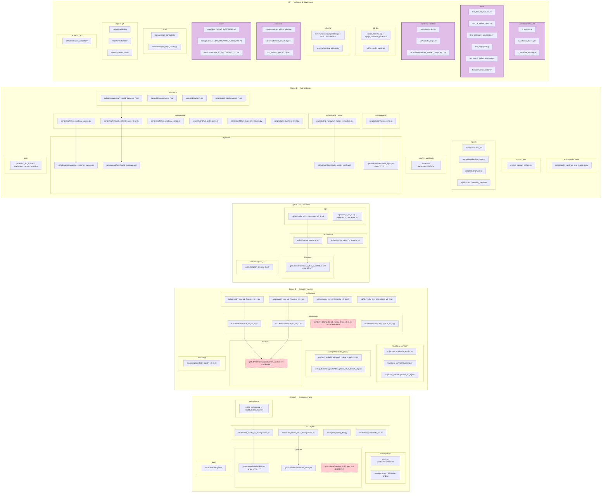

# Option Internal Pipeline Graph

```mermaid
%%─────────────────────────────────────────────────────────────────────────────
%% GRAPH 2 — OPTION INTERNAL PIPELINE GRAPH (BOX FORM)
%% Source: OPT_A/B/C/D/QA__ORG_MAP_DRAFT.md
%%─────────────────────────────────────────────────────────────────────────────
flowchart LR

  subgraph OPTA[Option A — Canonical Ingest]
    direction TB
    subgraph A_PIPES[Pipelines]
      A_wf_backfill[.github/workflows/backfill.yml - cron: 17 */6 * * *]
      A_wf_m15[.github/workflows/backfill_m15.yml]
      A_wf_full[.github/workflows/ovc_full_ingest.yml - DORMANT]
    end
    subgraph A_SUBS[Sub-systems]
      A_worker[infra/ovc-webhook/src/index.ts]
      A_r2[wrangler.jsonc - R2 bucket binding]
    end
    subgraph A_SRC[src/ ingest]
      A_backfill_2h[src/backfill_oanda_2h_checkpointed.py]
      A_backfill_m15[src/backfill_oanda_m15_checkpointed.py]
      A_ingest[src/ingest_history_day.py]
      A_tv_csv[src/history_sources/tv_csv.py]
    end
    subgraph A_SQL[sql/ schema]
      A_schema[sql/00_schema.sql + sql/01_tables_min.sql]
    end
    subgraph A_DATA[data/]
      A_raw[data/raw/tradingview/]
    end
  end

  subgraph OPTB[Option B — Derived Features]
    direction TB
    subgraph B_PIPES[Pipelines]
      B_wf_validate[.github/workflows/backfill_then_validate.yml - DORMANT]
    end
    subgraph B_SRC[src/derived/]
      B_c1[src/derived/compute_c1_v0_1.py]
      B_c2[src/derived/compute_c2_v0_1.py]
      B_c3[src/derived/compute_c3_regime_trend_v0_1.py - NOT INVOKED]
      B_stub[src/derived/compute_c3_stub_v0_1.py]
    end
    subgraph B_SQL[sql/derived/]
      B_v_c1[sql/derived/v_ovc_c1_features_v0_1.sql]
      B_v_c2[sql/derived/v_ovc_c2_features_v0_1.sql]
      B_v_c3[sql/derived/v_ovc_c3_features_v0_1.sql]
      B_v_sp[sql/derived/v_ovc_state_plane_v0_2.sql]
    end
    subgraph B_MODELS[trajectory_families/]
      B_fp[trajectory_families/fingerprint.py]
      B_cluster[trajectory_families/clustering.py]
      B_params[trajectory_families/params_v0_1.json]
    end
    subgraph B_CFG[configs/threshold_packs/]
      B_th_c3[configs/threshold_packs/c3_regime_trend_v1.json]
      B_th_sp[configs/threshold_packs/state_plane_v0_2_default_v1.json]
    end
    subgraph B_REG[src/config/]
      B_reg[src/config/threshold_registry_v0_1.py]
    end
  end

  subgraph OPTC[Option C — Outcomes]
    direction TB
    subgraph C_PIPES[Pipelines]
      C_wf[.github/workflows/ovc_option_c_schedule.yml - cron: 15 6 * * *]
    end
    subgraph C_SCRIPTS[scripts/run/]
      C_sh[scripts/run/run_option_c.sh]
      C_wrapper[scripts/run/run_option_c_wrapper.py]
    end
    subgraph C_SQL[sql/]
      C_sql[sql/option_c_v0_1.sql + sql/option_c_run_report.sql]
      C_outcomes[sql/derived/v_ovc_c_outcomes_v0_1.sql]
    end
    subgraph C_ART[artifacts/option_c/]
      C_sanity[artifacts/option_c/sanity_local/]
    end
  end

  subgraph OPTD[Option D — Paths / Bridge]
    direction TB
    subgraph D_PIPES[Pipelines]
      D_wf_p1[.github/workflows/path1_evidence.yml]
      D_wf_q[.github/workflows/path1_evidence_queue.yml]
      D_wf_replay[.github/workflows/path1_replay_verify.yml]
      D_wf_notion[.github/workflows/notion_sync.yml - cron: 17 */2 * * *]
    end
    subgraph D_P1[scripts/path1/]
      D_pack[scripts/path1/build_evidence_pack_v0_2.py]
      D_queue[scripts/path1/run_evidence_queue.py]
      D_range[scripts/path1/run_evidence_range.py]
      D_sp[scripts/path1/run_state_plane.py]
      D_tf[scripts/path1/run_trajectory_families.py]
      D_overlays[scripts/path1/overlays_v0_3.py]
    end
    subgraph D_REPLAY[scripts/path1_replay/]
      D_replay[scripts/path1_replay/run_replay_verification.py]
    end
    subgraph D_SEAL[scripts/path1_seal/]
      D_seal[scripts/path1_seal/run_seal_manifests.py]
    end
    subgraph D_OPS[src/ovc_ops/]
      D_artifact[src/ovc_ops/run_artifact.py]
    end
    subgraph D_EXPORT[scripts/export/]
      D_notion[scripts/export/notion_sync.py]
    end
    subgraph D_REPORTS[reports/]
      D_runs[reports/runs/run_id/]
      D_p1_ev[reports/path1/evidence/runs/]
      D_p1_scores[reports/path1/scores/]
      D_p1_tf[reports/path1/trajectory_families/]
    end
    subgraph D_SQL[sql/path1/]
      D_sql_ev[sql/path1/evidence/v_path1_evidence_*.sql]
      D_sql_sc[sql/path1/scores/score_*.sql]
      D_sql_st[sql/path1/studies/*.sql]
      D_sql_patch[sql/path1/db_patches/patch_*.sql]
    end
    subgraph D_INFRA[infra/ovc-webhook/]
      D_worker[infra/ovc-webhook/src/index.ts]
    end
    subgraph D_PINE[pine/]
      D_pine[pine/OVC_v0_1.pine + pine/export_module_v0.1.pine]
    end
  end

  subgraph QA[QA — Validation & Governance]
    direction TB
    subgraph QA_CI[.github/workflows CI]
      QA_pytest[ci_pytest.yml]
      QA_schema[ci_schema_check.yml]
      QA_sanity[ci_workflow_sanity.yml]
    end
    subgraph QA_TESTS[tests/]
      QA_t_derived[test_derived_features.py]
      QA_t_c3[test_c3_regime_trend.py]
      QA_t_contract[test_contract_equivalence.py]
      QA_t_fp[test_fingerprint.py]
      QA_t_replay[test_path1_replay_structural.py]
      QA_fixtures[fixtures/sample_exports/]
    end
    subgraph QA_VAL[Validation Harness]
      QA_val_day[src/validate_day.py]
      QA_val_range[src/validate_range.py]
      QA_val_derived[src/validate/validate_derived_range_v0_1.py]
    end
    subgraph QA_SQL[sql QA]
      QA_sql_qa[sql/qa_schema.sql + sql/qa_validation_pack*.sql]
      QA_sql_gate[sql/90_verify_gate2.sql]
    end
    subgraph QA_SCHEMA[schema/]
      QA_migrations[schema/applied_migrations.json - ALL UNVERIFIED]
      QA_objects[schema/required_objects.txt]
    end
    subgraph QA_CONTRACTS[contracts/]
      QA_c_export[export_contract_v0.1.1_min.json]
      QA_c_derived[derived_feature_set_v0.1.json]
      QA_c_artifact[run_artifact_spec_v0.1.json]
    end
    subgraph QA_DOCS[docs/]
      QA_d_doctrine[docs/doctrine/OVC_DOCTRINE.md]
      QA_d_govern[docs/governance/GOVERNANCE_RULES_v0.1.md]
      QA_d_contracts[docs/contracts/A_TO_D_CONTRACT_v1.md]
    end
    subgraph QA_TOOLS[tools/]
      QA_validate[tools/validate_contract.py]
      QA_maze[tools/maze/gen_repo_maze*.py]
    end
    subgraph QA_REPORTS[reports QA]
      QA_r_valid[reports/validation/]
      QA_r_verif[reports/verification/]
      QA_r_audit[reports/pipeline_audit/]
    end
    subgraph QA_ART[artifacts QA]
      QA_a_derived[artifacts/derived_validation/]
    end
  end

  %% Cross-cutting connections (script -> workflow)
  A_backfill_2h --> A_wf_backfill
  A_backfill_m15 --> A_wf_m15
  B_c1 --> B_wf_validate
  B_c2 --> B_wf_validate
  C_sh --> C_wf
  D_queue --> D_wf_q
  D_pack --> D_wf_p1
  D_replay --> D_wf_replay
  D_notion --> D_wf_notion

  %% src/ and sql/ cross references (conceptual)
  A_schema -.-> A_backfill_2h
  B_v_c1 -.-> B_c1
  B_v_c2 -.-> B_c2
  C_outcomes -.-> C_sh
  D_sql_ev -.-> D_pack

  %% Styling
  classDef dormant fill:#ffcdd2,stroke:#c62828,stroke-width:1px,stroke-dasharray:5
  classDef qaStyle fill:#e1bee7,stroke:#6a1b9a,stroke-width:2px

  class A_wf_full,B_wf_validate,B_c3 dormant
  class QA_CI,QA_TESTS,QA_VAL,QA_CONTRACTS,QA_DOCS qaStyle
```
