```mermaid
flowchart LR
    subgraph "Inputs"
        MIN[ovc.ovc_blocks_v01_1_min]
        C1[derived.ovc_c1_features_v0_1]
        C2[derived.ovc_c2_features_v0_1]
    end
    
    subgraph "Validation Script"
        VAL[validate_derived_range_v0_1.py]
        CHECKS[Run Validation Checks:<br/>• Feature presence<br/>• Value ranges<br/>• Consistency rules<br/>• Cross-table joins]
    end
    
    subgraph "Outputs"
        QA[ovc_qa.derived_validation_run<br/>ovc_qa.derived_validation_*]
        ARTIFACT[Run Artifact]
    end
    
    MIN --> VAL
    C1 --> VAL
    C2 --> VAL
    VAL --> CHECKS
    CHECKS --> QA
    CHECKS --> ARTIFACT
```

# OVC Infrastructure Workflows - Comprehensive Guide v0.1

> **[STATUS: ACTIVE]**  
> **Created:** 2026-01-22  
> **Purpose:** Comprehensive documentation of all workflows in the OVC system  
> **Audience:** Operators, developers, and architects  
> **Related Docs:** 
> - Canonical data flow: [`docs/architecture/OVC_DATA_FLOW_CANON_v0.1.md`](architecture/OVC_DATA_FLOW_CANON_v0.1.md)
> - Pipeline reality map: [`docs/architecture/PIPELINE_REALITY_MAP_v0.1.md`](architecture/PIPELINE_REALITY_MAP_v0.1.md)
> - Workflow status: [`docs/operations/WORKFLOW_STATUS.md`](operations/WORKFLOW_STATUS.md)

---

## Table of Contents

1. [System Overview](#1-system-overview)
2. [Data Architecture Layers](#2-data-architecture-layers)
3. [Pipeline Workflows](#3-pipeline-workflows)
   - [P1: Live Capture (TradingView → Neon)](#p1-live-capture-tradingview--neon)
   - [P2: Historical Backfill (OANDA → Neon)](#p2-historical-backfill-oanda--neon)
   - [B1: Derived Features Computation](#b1-derived-features-computation)
   - [B2: Derived Validation](#b2-derived-validation)
   - [C: Option C Evaluation/Outcomes](#c-option-c-evaluationoutcomes)
   - [D: Operations Layer](#d-operations-layer)
4. [Workflow Orchestration](#4-workflow-orchestration)
5. [Data Flow Diagrams](#5-data-flow-diagrams)
6. [Troubleshooting Guide](#6-troubleshooting-guide)
7. [Developer Commands Reference](#7-developer-commands-reference)

---

## 1. System Overview

### What is OVC?

OVC (Options Value Capture) is a **trading signal capture and evaluation system** that:
- Captures 2-hour market snapshots from TradingView alerts
- Backfills historical data from OANDA
- Derives multi-layered features from canonical market facts
- Evaluates predictions against realized outcomes
- Syncs evaluative results to Notion for human decision-making

### Core Design Principles

1. **Canonical Facts are Immutable** - Raw market data (Option A) is LOCKED
2. **Derived Layers are Replayable** - All computations can be regenerated from canonical sources
3. **Separation of Concerns** - Each layer has distinct ownership and purpose
4. **Human Decision Surface** - Only evaluative outcomes reach Notion
5. **Version Control** - All schemas and contracts are versioned

---

## 2. Data Architecture Layers

OVC organizes data into **four conceptual layers**, each with distinct ownership:

### Layer Hierarchy


### Schema Ownership

| Schema | Layer | Purpose | Writes Allowed From | Status |
|--------|-------|---------|---------------------|--------|
| `ovc` | Canonical Facts | Raw 2H block records | A-Ingest, P2-Backfill ONLY | **LOCKED** |
| `derived` | Features + Outcomes | Computed features and evaluation results | Option B/C scripts | Active |
| `ovc_qa` | Validation | Pipeline health and audit trails | Validation scripts | Active |
| `ovc_cfg` | Configuration | Threshold packs and versioning | Config tools | Active |
| `ops` | Sync State | Notion sync watermarks | Sync scripts | Active |

### Critical Boundaries

⚠️ **NEVER modify `ovc.ovc_blocks_v01_1_min` schema or ingest logic without explicit approval**

✅ **ALL derived computations must be replayable from canonical sources**

❌ **NO human-interpreted data in canonical layer**

---

## 3. Pipeline Workflows

### P1: Live Capture (TradingView → Neon)

**Purpose:** Ingest real-time 2H market snapshots from TradingView alerts

#### Flow Diagram


#### Components

| Component | Location | Purpose |
|-----------|----------|---------|
| **Pine Export** | `pine/export_module_v0.1.pine` | Generates MIN exports on 2H bar close |
| **Contract** | `contracts/export_contract_v0.1.1_min.json` | IMMUTABLE schema definition (~52 fields) |
| **Worker** | `infra/ovc-webhook/src/index.ts` | Validates and ingests exports |
| **Config** | `infra/ovc-webhook/wrangler.jsonc` | R2 binding, routes, secrets |
| **SQL Table** | `sql/01_tables_min.sql` | `ovc.ovc_blocks_v01_1_min` definition |

#### Validation Rules (Enforced by Worker)

1. **E_KEY_ORDER**: Keys must appear in exact contract order
2. **E_TYPE_COERCION**: Types must match (`int`, `float`, `bool_01`, `string_or_empty`)
3. **OHLC Consistency**: 
   - `h >= max(o, c)`
   - `l <= min(o, c)`
   - `rng = h - l`
   - `body = abs(c - o)`
4. **Return Semantic**: DISABLED for v0.1 stability

#### Endpoints

| Endpoint | Method | Auth | Payload | Use Case |
|----------|--------|------|---------|----------|
| `/tv` | POST | None | Raw pipe-delimited text | TradingView alerts |
| `/tv_secure` | POST | `OVC_TOKEN` | JSON envelope | Secure ingestion |

#### Developer Commands

```powershell
# Local testing (run from infra/ovc-webhook)
npm run dev
curl.exe -X POST http://localhost:8787/tv --data-binary "@tests/sample_exports/min_001.txt"

# Deploy to production
.\scripts\deploy_worker.ps1

# Test production endpoint
curl.exe -X POST https://ovc-webhook.owenguobadia24s.workers.dev/tv --data-binary "@tests/sample_exports/min_001.txt"

# Verify in Neon
psql $DATABASE_URL -c "SELECT block_id, sym, date_ny, ingest_ts FROM ovc.ovc_blocks_v01_1_min ORDER BY ingest_ts DESC LIMIT 5;"
```

#### Status & Health

| Attribute | Value |
|-----------|-------|
| Status | **PARTIAL** (env-dependent, structurally sound) |
| Trigger | HTTP webhook (TradingView alerts) |
| Frequency | Real-time (on 2H bar close) |
| Idempotency | PK: `(sym, date_ny, block2h)` with UPSERT |
| Run Artifacts | Not instrumented (stateless HTTP handler) |

#### Troubleshooting

**Issue:** "contract not found" error  
**Fix:** Run validator from repo root or use `.\scripts\verify_local.ps1`

**Issue:** "column does not exist" in Neon  
**Fix:** Sync `FIELDS` array in `index.ts` with `sql/01_tables_min.sql`

**Issue:** Worker deploy fails  
**Fix:** Check `wrangler.jsonc` and set secrets via `wrangler secret put OVC_TOKEN` and `wrangler secret put DATABASE_URL`

---

### P2: Historical Backfill (OANDA → Neon)

**Purpose:** Populate historical 2H blocks from OANDA H1 candles

#### Flow Diagram


#### Components

| Component | Location | Purpose |
|-----------|----------|---------|
| **Backfill Script** | `src/backfill_oanda_2h_checkpointed.py` | Canonical backfill implementation |
| **GitHub Workflow** | `.github/workflows/backfill.yml` | Scheduled execution (every 6h) |
| **Full Workflow** | `.github/workflows/backfill_then_validate.yml` | Range backfill + validation |
| **SQL Table** | `sql/01_tables_min.sql` | Same PK as P1 (idempotent) |

#### Execution Modes

**Mode 1: Single Day Backfill**
```powershell
# Set target date (NY timezone, YYYY-MM-DD format)
$env:BACKFILL_DATE_NY="2026-01-16"
python .\src\backfill_oanda_2h_checkpointed.py
```

**Mode 2: Date Range Backfill**
```powershell
# Backfill multiple days
python .\src\backfill_oanda_2h_checkpointed.py --start_ny 2026-01-13 --end_ny 2026-01-17
```

**Mode 3: Scheduled (GitHub Actions)**
- Automatically runs every 6 hours at :17 UTC
- Uses default date calculation (yesterday NY)
- Uploads run artifact to GitHub

#### Key Features

1. **Idempotent UPSERT**: Same PK as P1 → no duplicates on rerun
2. **Checkpointed Progress**: Resumes from last successful block
3. **RunWriter Instrumentation**: Emits standardized run artifacts
4. **OHLC Validation**: Enforces same semantic checks as P1

#### Data Flow Logic

```
OANDA H1 Candles (hourly)
    ↓
Group by 2H NY session blocks (A-L mapping)
    ↓
Aggregate: O=first, H=max, L=min, C=last
    ↓
Derive: rng, body, direction
    ↓
UPSERT to ovc.ovc_blocks_v01_1_min
```

#### Block Letter Mapping (NY Timezone)

| Block | Time Range (NY) | Example `block_id` |
|-------|----------------|-------------------|
| A | 00:00-02:00 | `20260116-A-GBPUSD` |
| B | 02:00-04:00 | `20260116-B-GBPUSD` |
| C | 04:00-06:00 | `20260116-C-GBPUSD` |
| D | 06:00-08:00 | `20260116-D-GBPUSD` |
| E | 08:00-10:00 | `20260116-E-GBPUSD` |
| F | 10:00-12:00 | `20260116-F-GBPUSD` |
| G | 12:00-14:00 | `20260116-G-GBPUSD` |
| H | 14:00-16:00 | `20260116-H-GBPUSD` |
| I | 16:00-18:00 | `20260116-I-GBPUSD` |
| J | 18:00-20:00 | `20260116-J-GBPUSD` |
| K | 20:00-22:00 | `20260116-K-GBPUSD` |
| L | 22:00-00:00 | `20260116-L-GBPUSD` |

#### Environment Variables

| Variable | Purpose | Required |
|----------|---------|----------|
| `NEON_DSN` | Neon database connection string | ✅ Yes |
| `OANDA_API_TOKEN` | OANDA API authentication | ✅ Yes |
| `OANDA_ENV` | Environment (practice/live) | ⚪ Default: practice |
| `BACKFILL_DATE_NY` | Single date to backfill | ⚪ Default: yesterday |

#### Status & Health

| Attribute | Value |
|-----------|-------|
| Status | **LIVE** (scheduled + manual) |
| Trigger | GitHub Actions cron + manual dispatch |
| Frequency | Every 6 hours at :17 UTC |
| Idempotency | ✅ Confirmed (0 inserts on rerun) |
| Run Artifacts | ✅ Instrumented (`line 18, 49, 529`) |

#### Troubleshooting

**Issue:** Backfill returns 0 candles  
**Fix:** Use weekday dates only; OANDA returns empty for weekends/holidays

**Issue:** Date parsing error  
**Fix:** Use `YYYY-MM-DD` format for `BACKFILL_DATE_NY`

**Issue:** Duplicate key conflicts  
**Fix:** Verify PK `(sym, date_ny, block2h)` exists in Neon table

---

### B1: Derived Features Computation

**Purpose:** Compute multi-layered features from canonical facts

#### Three-Layer Feature Hierarchy

```mermaid
flowchart TD
    subgraph "Canonical Input"
        MIN[ovc.ovc_blocks_v01_1_min<br/>OHLC, timestamps, tags]
    end
    
    subgraph "C1 Layer - Single Bar"
        C1[compute_c1_v0_1.py<br/>derived.ovc_c1_features_v0_1]
        C1_FEAT[Features:<br/>• range_pct, body_pct<br/>• range_z_12, body_z_12<br/>• clv, wick ratios<br/>• direction flags]
    end
    
    subgraph "C2 Layer - Multi Bar"
        C2[compute_c2_v0_1.py<br/>derived.ovc_c2_features_v0_1]
        C2_FEAT[Features:<br/>• Rolling volatility<br/>• Lag/lead analysis<br/>• Session aggregates<br/>• Gap metrics]
    end
    
    subgraph "C3 Layer - Semantic"
        C3[compute_c3_regime_trend_v0_1.py<br/>derived.ovc_c3_regime_trend_v0_1]
        C3_FEAT[Tags:<br/>• c3_regime_trend<br/>• TREND / NON_TREND<br/>• Threshold provenance]
    end
    
    MIN --> C1
    C1 --> C1_FEAT
    MIN --> C2
    C1 --> C2
    C2 --> C2_FEAT
    C2 --> C3
    C3 --> C3_FEAT
    
    style MIN fill:#f99,stroke:#900,stroke-width:2px
    style C1 fill:#9cf,stroke:#06c
    style C2 fill:#9cf,stroke:#06c
    style C3 fill:#9cf,stroke:#06c
```



#### C1: Single-Bar Features

**Script:** `src/derived/compute_c1_v0_1.py`

**Features Computed:**
- `range_pct`: (h-l)/c × 100
- `body_pct`: |c-o|/c × 100
- `range_z_12`: Z-score of range over 12 blocks
- `body_z_12`: Z-score of body over 12 blocks
- `clv`: Close Location Value [(c-l)-(h-c)] / (h-l)
- `upper_wick_pct`, `lower_wick_pct`: Wick ratios
- Direction flags and OHLC consistency checks

**Execution:**
```powershell
# Manual run (date range)
python .\src\derived\compute_c1_v0_1.py --start_date 2026-01-01 --end_date 2026-01-31

# Single date
python .\src\derived\compute_c1_v0_1.py --start_date 2026-01-16 --end_date 2026-01-16
```

**Output Table:** `derived.ovc_c1_features_v0_1`

#### C2: Multi-Bar Features

**Script:** `src/derived/compute_c2_v0_1.py`

**Features Computed:**
- Rolling volatility windows (3, 6, 12 blocks)
- Lag/lead price relationships
- Session-level aggregates (daily high/low)
- Gap analysis (opening gaps relative to prior close)
- Multi-bar patterns

**Execution:**
```powershell
# Manual run (date range)
python .\src\derived\compute_c2_v0_1.py --start_date 2026-01-01 --end_date 2026-01-31
```

**Output Table:** `derived.ovc_c2_features_v0_1`

**Dependencies:** Requires C1 features to be computed first

#### C3: Semantic Regime Tags

**Script:** `src/derived/compute_c3_regime_trend_v0_1.py`

**Tags Computed:**
- `c3_regime_trend`: TREND / NON_TREND classification
- Threshold-based regime detection
- Provenance tracking (threshold pack version)

**Execution:**
```powershell
# Manual run with threshold pack
python .\src\derived\compute_c3_regime_trend_v0_1.py --threshold_pack_id <pack_id> --start_date 2026-01-01 --end_date 2026-01-31
```

**Output Table:** `derived.ovc_c3_regime_trend_v0_1`

**Dependencies:** 
- Requires C2 features
- Requires threshold pack in `ovc_cfg.threshold_pack`

#### Status & Health

| Layer | Status | Trigger | RunWriter | Tests |
|-------|--------|---------|-----------|-------|
| C1 | **LIVE** | Workflow + CLI | ✅ Lines 42, 355 | ✅ 24 tests pass |
| C2 | **LIVE** | Workflow + CLI | ✅ Lines 46, 569 | ✅ Included in C1 suite |
| C3 | **PARTIAL** | CLI only (not in workflow) | ✅ Lines 86, 419 | ✅ 20 tests (19 pass, 1 skip) |

#### Canonical Rules

✅ **All features must be derivable from canonical facts only**

✅ **Feature computations must be replayable**

❌ **No human interpretation in feature layer**

❌ **No mutating canonical facts**

---

### B2: Derived Validation

**Purpose:** Validate derived feature correctness against known invariants

#### Flow Diagram



#### Components

| Component | Location | Purpose |
|-----------|----------|---------|
| **Validation Script** | `src/validate/validate_derived_range_v0_1.py` | Derived feature validation |
| **QA Schema** | `sql/03_qa_derived_validation_v0_1.sql` | Validation artifact tables |
| **Tests** | `tests/test_validate_derived.py` | 50 validation tests |

#### Validation Checks

1. **Presence Validation**: All blocks have corresponding features
2. **Range Validation**: Features within expected bounds
3. **Consistency Validation**: Cross-feature relationships maintained
4. **Join Validation**: All derived records join back to canonical

#### Execution

```powershell
# Validate date range
python .\src\validate\validate_derived_range_v0_1.py --start_date 2026-01-01 --end_date 2026-01-31

# Single date
python .\src\validate\validate_derived_range_v0_1.py --start_date 2026-01-16 --end_date 2026-01-16
```

#### Status & Health

| Attribute | Value |
|-----------|-------|
| Status | **LIVE** (called by workflows) |
| Trigger | GitHub Actions (backfill_then_validate.yml) |
| RunWriter | ✅ Lines 55, 1072 |
| Tests | ✅ 50 tests pass |

#### Behavior

- **Core validation**: Always runs (unconditional)
- **Derived validation**: Conditional (skipped when derived tables absent)

---

### C: Option C Evaluation/Outcomes

**Purpose:** Measure prediction accuracy against realized price action

#### Flow Diagram



```mermaid
flowchart TB
    subgraph "Inputs"
        MIN[ovc.ovc_blocks_v01_1_min<br/>Canonical facts]
        FEAT[derived.ovc_block_features_v0_1<br/>C1+C2 features]
    end
    
    subgraph "Option C Runner"
        SCRIPT[scripts/run_option_c.sh]
        SQL[sql/option_c_v0_1.sql]
    end
    
    subgraph "Views Created"
        OUTCOMES[derived.v_ovc_c_outcomes_v0_1<br/>• fwd_ret_1, fwd_ret_3, fwd_ret_6<br/>• mfe_3, mfe_6<br/>• mae_3, mae_6<br/>• rvol_6<br/>• hit_* flags]
        SCORES[derived.ovc_scores_v0_1<br/>Aggregated scoring by bucket]
    end
    
    subgraph "Outputs"
        NOTION[Notion Sync<br/>outcomes database]
        ARTIFACT[Run Artifact<br/>evaluation reports]
    end
    
    MIN --> SCRIPT
    FEAT --> SCRIPT
    SCRIPT --> SQL
    SQL --> OUTCOMES
    SQL --> SCORES
    OUTCOMES --> NOTION
    OUTCOMES --> ARTIFACT
```

#### Outcome Metrics (CANONICAL)

**Forward Returns:**
- `fwd_ret_1`: Return over next 1 block (2H)
- `fwd_ret_3`: Return over next 3 blocks (6H)
- `fwd_ret_6`: Return over next 6 blocks (12H)

**Risk Metrics:**
- `mfe_3`: Maximum Favorable Excursion (3 blocks)
- `mfe_6`: Maximum Favorable Excursion (6 blocks)
- `mae_3`: Maximum Adverse Excursion (3 blocks)
- `mae_6`: Maximum Adverse Excursion (6 blocks)
- `rvol_6`: Realized volatility over 6 blocks

**Hit Flags:**
- `hit_1`, `hit_2`, `hit_6`, `hit_12`: Binary success indicators

**DRAFT Outcomes (NOT CANONICAL):**
- `ttt_*` (time-to-target): Deferred, pending parameterization

#### Components

| Component | Location | Purpose |
|-----------|----------|---------|
| **SQL Views** | `sql/option_c_v0_1.sql` | Outcome definitions (323 lines) |
| **Runner Script** | `scripts/run_option_c.sh` | Option C execution wrapper |
| **PowerShell Wrapper** | `scripts/run_option_c.ps1` | Local execution helper |
| **GitHub Workflow** | `.github/workflows/ovc_option_c_schedule.yml` | Scheduled evaluation |

#### Execution

```powershell
# Local run with run_id
.\scripts\run_option_c.ps1 -RunId "local_test_2026-01-22"

# Via bash (Linux/Mac)
bash scripts/run_option_c.sh
```

#### GitHub Actions Schedule

- **Frequency**: Daily at 06:15 UTC (`15 6 * * *`)
- **Artifacts**: Uploaded to GitHub Actions (`lines 99, 107`)
- **Status**: **LIVE**

#### Notion Sync Integration

Only evaluative outcomes flow to Notion:
- ✅ `fwd_ret_*`: Forward returns
- ✅ `hit_*`: Binary success flags
- ✅ `mfe_*`, `mae_*`: Risk metrics
- ❌ Feature vectors (intermediate calculations)
- ❌ Raw OHLC (canonical facts)

#### Status & Health

| Attribute | Value |
|-----------|-------|
| Status | **CANONICAL** (frozen as of ovc-v0.1-spine) |
| Trigger | GitHub Actions schedule + manual |
| Frequency | Daily at 06:15 UTC |
| Run Artifacts | ✅ Uploaded (lines 99, 107) |
| Breaking Changes | ⛔ Require MAJOR version bump |

---

### D: Operations Layer

#### D1: Notion Sync

**Purpose:** Sync evaluative outcomes to Notion for human decision-making


**Components:**
- **Script**: `scripts/notion_sync.py` (384 lines)
- **Workflow**: `.github/workflows/notion_sync.yml`
- **Schedule**: Every 2 hours at :17 UTC (`17 */2 * * *`)

**Environment Variables:**
| Variable | Purpose | Note |
|----------|---------|------|
| `DATABASE_URL` | Neon connection | Required |
| `NOTIOM_TOKEN` | Notion API token | **Canonical spelling** (not a typo) |
| `NOTION_BLOCKS_DB_ID` | Blocks database ID | Required |
| `NOTION_OUTCOMES_DB_ID` | Outcomes database ID | Required |
| `NOTION_RUNS_DB_ID` | Runs database ID | Optional |

**Sync Behavior:**
- Incremental watermark tracking
- Upsert-based (idempotent)
- RunWriter instrumented (lines 15-16)

**Status:** **LIVE** (scheduled + manual)

#### D2: Validation Harness

**Purpose:** Validate canonical facts against tape sources


**Components:**
- **Scripts**: `src/validate_day.py`, `src/validate_range.py`
- **QA Schema**: `sql/qa_schema.sql`
- **Workflow**: `.github/workflows/backfill_then_validate.yml` (manual)

**Execution:**
```powershell
# Validate single day
python .\src\validate_day.py --symbol GBPUSD --date_ny 2026-01-16

# Validate date range
python .\src\validate_range.py --symbol GBPUSD --start_date 2026-01-01 --end_date 2026-01-31
```

**Validation Checks:**
- Block presence (all expected blocks exist)
- OHLC accuracy (compared to tape)
- Timing consistency (bar close timestamps)
- Duplicate detection

**Status:** **LIVE** (CLI + workflow)

---

## 4. Workflow Orchestration

### GitHub Actions Schedules (UTC)

| Workflow | File | Schedule | Purpose | Status |
|----------|------|----------|---------|--------|
| **OVC Backfill** | `.github/workflows/backfill.yml` | `17 */6 * * *` (every 6h) | P2 canonical backfill | ✅ LIVE |
| **Notion Sync** | `.github/workflows/notion_sync.yml` | `17 */2 * * *` (every 2h) | D-NotionSync to Notion | ✅ LIVE |
| **Option C** | `.github/workflows/ovc_option_c_schedule.yml` | `15 6 * * *` (daily 06:15) | C-Eval outcomes | ✅ LIVE |

### Manual-Only Workflows (DORMANT)

| Workflow | File | Purpose | Status |
|----------|------|---------|--------|
| **Backfill + Validate** | `.github/workflows/backfill_then_validate.yml` | Range backfill with full validation | 🟡 DORMANT |
| **FULL Ingest** | `.github/workflows/ovc_full_ingest.yml` | FULL payload stub (not production) | 🟡 DORMANT |

### Execution Sequence (Typical Day)

```mermaid
gantt
    title OVC Daily Workflow Execution (UTC)
    dateFormat HH:mm
    axisFormat %H:%M
    
    section P2 Backfill
    Backfill Run 1  :00:17, 1h
    Backfill Run 2  :06:17, 1h
    Backfill Run 3  :12:17, 1h
    Backfill Run 4  :18:17, 1h
    
    section Option C
    Daily Evaluation :06:15, 2h
    
    section Notion Sync
    Sync Run 1 :00:17, 30m
    Sync Run 2 :02:17, 30m
    Sync Run 3 :04:17, 30m
    Sync Run 4 :06:17, 30m
    Sync Run 5 :08:17, 30m
    Sync Run 6 :10:17, 30m
    Sync Run 7 :12:17, 30m
    Sync Run 8 :14:17, 30m
    Sync Run 9 :16:17, 30m
    Sync Run 10 :18:17, 30m
    Sync Run 11 :20:17, 30m
    Sync Run 12 :22:17, 30m
```



### Run Artifact System

**All instrumented pipelines emit standardized run artifacts:**

| Component | Path | Purpose |
|-----------|------|---------|
| **Spec** | `contracts/run_artifact_spec_v0.1.json` | JSON Schema for run artifacts |
| **Helper** | `src/ovc_ops/run_artifact.py` | `RunWriter` class |
| **CLI** | `src/ovc_ops/run_artifact_cli.py` | CLI wrapper |
| **Docs** | `docs/runbooks/RUN_ARTIFACT_SPEC_v0.1.md` | Specification |

**Instrumented Pipelines:**
- P2-Backfill (lines 18, 49, 529)
- B1-DerivedC1 (lines 42, 355)
- B1-DerivedC2 (lines 46, 569)
- B1-DerivedC3 (lines 86, 419)
- B2-DerivedValidation (lines 55, 1072)
- D-NotionSync (lines 15-16)
- D-ValidationHarness (lines 16, 408)

**Artifact Location:** `reports/runs/<pipeline_id>/<run_id>/run.json`

---

## 5. Data Flow Diagrams

### Complete System Data Flow


### State Transitions


---

## 6. Troubleshooting Guide

### Common Issues & Solutions

#### Pipeline Failures

| Issue | Symptom | Fix |
|-------|---------|-----|
| **Contract validation failure** | "E_KEY_ORDER" or "E_TYPE_COERCION" | Validate export against `contracts/export_contract_v0.1.1_min.json` |
| **Missing columns in Neon** | "column does not exist" error | Sync `FIELDS` array in `index.ts` with `sql/01_tables_min.sql` |
| **Backfill returns 0 candles** | No inserts on valid date | Use weekday dates only; weekends/holidays return empty |
| **Duplicate key conflicts** | "duplicate key value violates unique constraint" | Verify PK `(sym, date_ny, block2h)` exists; check UPSERT logic |
| **Worker deployment fails** | "wrangler deploy" errors | Check `wrangler.jsonc`; set secrets via `wrangler secret put` |

#### Environment Issues

| Issue | Symptom | Fix |
|-------|---------|-----|
| **Missing DATABASE_URL** | Connection refused or auth errors | Set `$env:DATABASE_URL` or `export DATABASE_URL=...` |
| **OANDA API failures** | HTTP 401 or 403 errors | Verify `OANDA_API_TOKEN` is set and valid |
| **Notion sync fails** | "NOTIOM_TOKEN not found" | Set `NOTIOM_TOKEN` (canonical spelling) |
| **Date parsing errors** | "time data ... does not match format" | Use `YYYY-MM-DD` format for all date parameters |

#### Data Quality Issues

| Issue | Symptom | Fix |
|-------|---------|-----|
| **OHLC inconsistencies** | Validation errors in derived layers | Check canonical data with `validate_day.py` |
| **Missing derived features** | NULL values in C1/C2 tables | Rerun `compute_c1_v0_1.py` and `compute_c2_v0_1.py` |
| **Outcome mismatches** | Unexpected hit rates or forward returns | Verify Option C views with `sql/option_c_v0_1.sql` |

### Diagnostic Commands

```powershell
# Check pipeline status
python .\scripts\pipeline_status.py --mode detect

# Verify local setup
.\scripts\verify_local.ps1

# Test worker locally
cd infra/ovc-webhook
npm run dev
curl.exe -X POST http://localhost:8787/tv --data-binary "@tests/sample_exports/min_001.txt"

# Validate export against contract
python -m tools.validate_contract contracts/export_contract_v0.1.1_min.json tests/sample_exports/min_001.txt

# Check Neon table counts
psql $DATABASE_URL -c "SELECT COUNT(*) FROM ovc.ovc_blocks_v01_1_min;"
psql $DATABASE_URL -c "SELECT COUNT(*) FROM derived.ovc_c1_features_v0_1;"
psql $DATABASE_URL -c "SELECT COUNT(*) FROM derived.ovc_outcomes_v0_1;"

# Verify recent inserts
psql $DATABASE_URL -c "SELECT block_id, sym, date_ny, ingest_ts FROM ovc.ovc_blocks_v01_1_min ORDER BY ingest_ts DESC LIMIT 10;"
```

---

## 7. Developer Commands Reference

### Verification & Testing

```powershell
# Run all local verification (contract + pytest)
.\scripts\verify_local.ps1

# Run specific test suite
pytest tests/test_min_contract_validation.py -v
pytest tests/test_derived_features.py -v
pytest tests/test_c3_regime_trend.py -v

# Worker tests (TypeScript/Vitest)
cd infra/ovc-webhook
npx vitest
```

### Deployment

```powershell
# Deploy worker to Cloudflare
.\scripts\deploy_worker.ps1

# Set worker secrets
cd infra/ovc-webhook
wrangler secret put OVC_TOKEN
wrangler secret put DATABASE_URL
```

### Backfill Operations

```powershell
# Single day backfill
$env:BACKFILL_DATE_NY="2026-01-16"
python .\src\backfill_oanda_2h_checkpointed.py

# Date range backfill
python .\src\backfill_oanda_2h_checkpointed.py --start_ny 2026-01-13 --end_ny 2026-01-17

# Backfill with validation
python .\src\backfill_oanda_2h_checkpointed.py
python .\scripts\pipeline_status.py --mode detect --ignore-unknown
python .\src\validate_day.py --symbol GBPUSD --date_ny 2026-01-16
```

### Derived Features

```powershell
# Compute C1 features (single day)
python .\src\derived\compute_c1_v0_1.py --start_date 2026-01-16 --end_date 2026-01-16

# Compute C2 features (date range)
python .\src\derived\compute_c2_v0_1.py --start_date 2026-01-01 --end_date 2026-01-31

# Compute C3 regime tags
python .\src\derived\compute_c3_regime_trend_v0_1.py --threshold_pack_id <pack_id> --start_date 2026-01-01 --end_date 2026-01-31

# Validate derived features
python .\src\validate\validate_derived_range_v0_1.py --start_date 2026-01-01 --end_date 2026-01-31
```

### Option C Evaluation

```powershell
# Run Option C locally
.\scripts\run_option_c.ps1 -RunId "local_test"

# Run Option C (bash)
bash scripts/run_option_c.sh
```

### Notion Sync

```powershell
# Manual Notion sync
python .\scripts\notion_sync.py

# Check sync state
psql $DATABASE_URL -c "SELECT * FROM ops.notion_sync_state ORDER BY last_sync_at DESC LIMIT 5;"
```

### Validation & QA

```powershell
# Validate single day
python .\src\validate_day.py --symbol GBPUSD --date_ny 2026-01-16

# Validate date range
python .\src\validate_range.py --symbol GBPUSD --start_date 2026-01-01 --end_date 2026-01-31

# Check validation results
psql $DATABASE_URL -c "SELECT * FROM ovc_qa.validation_run ORDER BY run_start DESC LIMIT 10;"
```

### SQL Queries

```sql
-- Recent blocks
SELECT block_id, sym, date_ny, bar_close_ms, ingest_ts
FROM ovc.ovc_blocks_v01_1_min
ORDER BY ingest_ts DESC
LIMIT 50;

-- Block counts by day
SELECT date_ny, COUNT(*) as block_count
FROM ovc.ovc_blocks_v01_1_min
WHERE sym = 'GBPUSD'
GROUP BY date_ny
ORDER BY date_ny DESC;

-- Derived feature coverage
SELECT 
  (SELECT COUNT(*) FROM ovc.ovc_blocks_v01_1_min WHERE date_ny = '2026-01-16') as canonical_blocks,
  (SELECT COUNT(*) FROM derived.ovc_c1_features_v0_1 WHERE date_ny = '2026-01-16') as c1_features,
  (SELECT COUNT(*) FROM derived.ovc_c2_features_v0_1 WHERE date_ny = '2026-01-16') as c2_features;

-- Outcome metrics
SELECT block_id, fwd_ret_1, fwd_ret_3, fwd_ret_6, hit_1, hit_3, hit_6
FROM derived.v_ovc_c_outcomes_v0_1
WHERE date_ny = '2026-01-16'
ORDER BY block2h;
```

---

## Appendix A: Key File Locations

### Contracts & Schemas

| File | Purpose |
|------|---------|
| `contracts/export_contract_v0.1.1_min.json` | MIN contract (IMMUTABLE) |
| `contracts/run_artifact_spec_v0.1.json` | Run artifact schema |
| `sql/01_tables_min.sql` | Canonical table definition |
| `sql/02_derived_c1_c2_tables_v0_1.sql` | C1/C2 feature tables |
| `sql/05_c3_regime_trend_v0_1.sql` | C3 semantic tags |
| `sql/option_c_v0_1.sql` | Option C outcomes views |
| `sql/qa_schema.sql` | Validation artifact tables |

### Scripts & Pipelines

| File | Purpose |
|------|---------|
| `infra/ovc-webhook/src/index.ts` | Cloudflare Worker (P1 ingest) |
| `src/backfill_oanda_2h_checkpointed.py` | P2 backfill (canonical) |
| `src/derived/compute_c1_v0_1.py` | C1 feature computation |
| `src/derived/compute_c2_v0_1.py` | C2 feature computation |
| `src/derived/compute_c3_regime_trend_v0_1.py` | C3 regime tagging |
| `src/validate/validate_derived_range_v0_1.py` | Derived validation |
| `scripts/run_option_c.sh` | Option C runner |
| `scripts/notion_sync.py` | Notion sync |
| `src/validate_day.py` | Single day validation |
| `src/validate_range.py` | Range validation |

### Documentation

| File | Purpose |
|------|---------|
| `docs/architecture/OVC_DATA_FLOW_CANON_v0.1.md` | Canonical data flow |
| `docs/architecture/PIPELINE_REALITY_MAP_v0.1.md` | Pipeline reality map |
| `docs/operations/WORKFLOW_STATUS.md` | Quick reference status |
| `docs/runbooks/RUN_ARTIFACT_SPEC_v0.1.md` | Run artifact spec |
| `docs/runbooks/option_b1_runbook.md` | B1 layer runbook |
| `docs/runbooks/option_c_runbook.md` | Option C runbook |

### Tests

| File | Purpose |
|------|---------|
| `tests/test_min_contract_validation.py` | MIN contract tests |
| `tests/test_derived_features.py` | C1/C2 feature tests |
| `tests/test_c3_regime_trend.py` | C3 regime tests |
| `tests/test_validate_derived.py` | Derived validation tests |
| `infra/ovc-webhook/test/index.spec.ts` | Worker unit tests |

---

## Appendix B: Glossary

| Term | Definition |
|------|------------|
| **MIN** | Minimal export profile (~52 fields) for webhook ingestion |
| **FULL** | Complete export profile (~150 fields) for debug/research |
| **Canonical Facts** | Immutable raw market data (Option A layer) |
| **Derived Features** | Computed features from canonical facts (Option B layer) |
| **Outcomes** | Forward-looking evaluation metrics (Option C layer) |
| **Block** | 2-hour market snapshot (A-L mapping in NY timezone) |
| **PK** | Primary key: `(sym, date_ny, block2h)` |
| **RunWriter** | Standardized run artifact emission system |
| **UPSERT** | Insert or update on conflict (idempotent) |
| **C1** | Single-bar features (range, body, CLV, wicks) |
| **C2** | Multi-bar features (rolling stats, gaps, volatility) |
| **C3** | Semantic regime tags (TREND/NON_TREND) |
| **MFE** | Maximum Favorable Excursion (best price move) |
| **MAE** | Maximum Adverse Excursion (worst price move) |
| **Hit Flag** | Binary indicator (prediction success/failure) |
| **NOTIOM_TOKEN** | Canonical spelling of Notion API token (not a typo) |

---

*End of Comprehensive Workflows Guide v0.1*