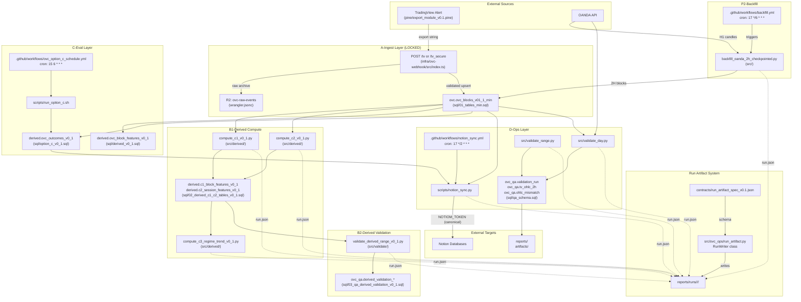

# Pipeline Reality Map v0.1

> **Generated:** 2026-01-19  
> **Last Updated:** 2026-01-19 (run artifact system + fixes)  
> **Audit Type:** Deterministic, evidence-based  
> **Methodology:** File inspection, test execution, config analysis (no external API calls)

---

## A) Executive Table

| Pipeline ID | Status | Trigger Type | Entry Point(s) | Dependencies | Proof |
|-------------|--------|--------------|----------------|--------------|-------|
| **A-Ingest** | PARTIAL | HTTP webhook | `infra/ovc-webhook/src/index.ts` | Neon (DATABASE_URL), R2 (RAW_EVENTS), OVC_TOKEN | Worker compiles (tsc); tests PASS; deployment status UNKNOWN |
| **P2-Backfill** | LIVE | GitHub Actions schedule + manual | `src/backfill_oanda_2h_checkpointed.py`, `.github/workflows/backfill.yml` | NEON_DSN, OANDA_API_TOKEN, OANDA_ENV | Scheduled cron `17 */6 * * *`; RunWriter instrumented; upload-artifact:58 |
| **P2-BackfillValidate** | DORMANT | GitHub Actions manual | `.github/workflows/backfill_then_validate.yml` | NEON_DSN, OANDA_API_TOKEN | No schedule; workflow_dispatch only; upload-artifact:175,183 |
| **B1-DerivedC1** | LIVE | Called by workflows | `src/derived/compute_c1_v0_1.py` | NEON_DSN | Tests pass; RunWriter instrumented (line 42, 355) |
| **B1-DerivedC2** | LIVE | Called by workflows | `src/derived/compute_c2_v0_1.py` | NEON_DSN | Tests pass; RunWriter instrumented (line 46, 569) |
| **B1-DerivedC3** | PARTIAL | CLI only | `src/derived/compute_c3_regime_trend_v0_1.py` | NEON_DSN, ovc_cfg.threshold_packs | Tests pass; RunWriter instrumented (line 86, 419); no workflow integration |
| **B2-DerivedValidation** | LIVE | Called by workflows | `src/validate/validate_derived_range_v0_1.py` | NEON_DSN, derived.* tables | Tests pass; RunWriter instrumented (line 55, 1072) |
| **C-Eval** | LIVE | GitHub Actions schedule + manual | `scripts/run_option_c.sh`, `.github/workflows/ovc_option_c_schedule.yml` | DATABASE_URL, derived.* views | Scheduled cron `15 6 * * *`; upload-artifact:99,107 |
| **D-NotionSync** | LIVE | GitHub Actions schedule + manual | `scripts/notion_sync.py`, `.github/workflows/notion_sync.yml` | DATABASE_URL, NOTIOM_TOKEN (canonical), NOTION_*_DB_ID | Scheduled cron `17 */2 * * *`; RunWriter instrumented; upload-artifact:34 |
| **D-ValidationHarness** | LIVE | CLI / workflow | `src/validate_day.py`, `src/validate_range.py` | NEON_DSN, ovc_qa.* | Tests pass; RunWriter instrumented (validate_day:16,408; validate_range:23,677) |
| **CI-WorkerTests** | LIVE | Local (npm test) | `infra/ovc-webhook/test/index.spec.ts` | None | 2 tests PASS (exports added at index.ts:10,29) |
| **CI-PythonTests** | LIVE | Local (pytest) | `tests/*.py` | None (some skip without DB) | 134 passed, 1 skipped |

### Status Legend
- **LIVE**: Scheduled/deployed AND code functional (now: 9 pipelines)
- **PARTIAL**: Code exists but has issues OR deployment/schedule unverifiable (now: 2 pipelines)
- **DORMANT**: Code exists but no active trigger (manual only with no evidence of use) (now: 1 pipeline)
- **UNKNOWN**: Cannot determine from repo evidence alone

---

## B) Wiring Graph (Current State)

---

## C) Gap Graph (Remaining Gaps)

```mermaid
flowchart TD
    subgraph "RESOLVED - Worker Tests ✓"
        TEST_SPEC_OK["infra/ovc-webhook/test/index.spec.ts<br/>✓ 2 tests PASS"]
        INDEX_TS_OK["index.ts exports parseExport (line 10)<br/>index.ts exports msToTimestamptzStart2H (line 29)"]
    end

    subgraph "RESOLVED - Notion Sync ✓"
        NOTION_OK["scripts/notion_sync.py<br/>✓ NOTIOM_TOKEN is CANONICAL spelling<br/>✓ RunWriter instrumented<br/>✓ required-env check at startup"]
    end

    subgraph "RESOLVED - Run Artifacts ✓"
        ARTIFACT_OK["All scheduled pipelines now emit run artifacts<br/>✓ P2-Backfill: upload-artifact:58<br/>✓ C-Eval: upload-artifact:99,107<br/>✓ D-NotionSync: upload-artifact:34"]
    end

    subgraph "UNKNOWN - Worker Deployment"
        WRANGLER_CFG["wrangler.jsonc"]
        DEPLOY_STATUS["Deployment Status: UNKNOWN<br/>(no wrangler whoami / deploy log in repo)"]
        SECRETS_STATUS["Secrets Status: UNKNOWN<br/>(OVC_TOKEN, DATABASE_URL)"]
    end

    subgraph "DORMANT - Workflows"
        GH_FULL_INGEST[".github/workflows/ovc_full_ingest.yml"]
        GH_BACKFILL_VAL[".github/workflows/backfill_then_validate.yml"]
        NO_SCHEDULE["NO SCHEDULE<br/>workflow_dispatch only"]
    end

    subgraph "PARTIAL - C3 Integration"
        C3_SCRIPT["src/derived/compute_c3_regime_trend_v0_1.py"]
        NO_WORKFLOW["NOT INTEGRATED<br/>No workflow calls C3"]
        THRESH_REG["ovc_cfg.threshold_packs<br/>Requires manual setup"]
    end

    WRANGLER_CFG --> DEPLOY_STATUS
    WRANGLER_CFG --> SECRETS_STATUS

    GH_FULL_INGEST --> NO_SCHEDULE
    GH_BACKFILL_VAL --> NO_SCHEDULE

    C3_SCRIPT --> NO_WORKFLOW
    C3_SCRIPT --> THRESH_REG

    classDef resolved fill:#9f9,stroke:#090
    classDef unknown fill:#ff9,stroke:#c90
    classDef dormant fill:#9cf,stroke:#06c
    classDef partial fill:#f9f,stroke:#909

    class TEST_SPEC_OK,INDEX_TS_OK,NOTION_OK,ARTIFACT_OK resolved
    class DEPLOY_STATUS,SECRETS_STATUS unknown
    class GH_FULL_INGEST,GH_BACKFILL_VAL dormant
    class NO_WORKFLOW,THRESH_REG partial
```

### Gap Details

| Gap ID | Type | Current State | Expected State | Evidence |
|--------|------|---------------|----------------|----------|
| G1 | ~~BROKEN~~ **RESOLVED** | ~~Worker tests fail~~ Tests PASS | Tests should pass | `export function parseExport` at index.ts:10; `export function msToTimestamptzStart2H` at index.ts:29; `npm test` → 2 passed |
| G2 | ~~BROKEN~~ **RESOLVED** | `NOTIOM_TOKEN` is **canonical** | N/A (design decision) | notion_sync.py:19-24 defines REQUIRED_ENV_VARS; workflow notion_sync.yml:25 passes `NOTIOM_TOKEN: ${{ secrets.NOTIOM_TOKEN }}`; check_required_env() validates at startup |
| G3 | UNKNOWN | Worker deployment status | Should have deployment evidence | No wrangler deploy logs in repo |
| G4 | UNKNOWN | Worker secrets (OVC_TOKEN, DATABASE_URL) | Should be set in Cloudflare | No verification possible without API access |
| G5 | DORMANT | `backfill_then_validate.yml` manual only | Could be scheduled for regression | workflow_dispatch without schedule |
| G6 | DORMANT | `ovc_full_ingest.yml` manual only | N/A (stub) | workflow_dispatch without schedule |
| G7 | PARTIAL | C3 not in any workflow | Should be integrated post-C2 | compute_c3_regime_trend_v0_1.py exists but not called |
| G8 | ~~UNKNOWN~~ **RESOLVED** | Run artifacts now emitted | Run artifacts in all scheduled pipelines | backfill.yml:58, notion_sync.yml:34, ovc_option_c_schedule.yml:99,107 all have `upload-artifact`; all scripts import RunWriter |

---

## D) Evidence Index

### A-Ingest
| Path | Line(s) | Evidence |
|------|---------|----------|
| infra/ovc-webhook/src/index.ts | 1-731 | Full worker implementation with MIN validation |
| infra/ovc-webhook/src/index.ts | 10, 29 | `export function parseExport`, `export function msToTimestamptzStart2H` |
| infra/ovc-webhook/wrangler.jsonc | 1-25 | R2 bucket binding, name "ovc-webhook" |
| infra/ovc-webhook/package.json | 6-12 | Scripts: deploy, dev, test |
| infra/ovc-webhook/test/index.spec.ts | 1-21 | Tests PASS (2/2) - imports now work |

### P2-Backfill
| Path | Line(s) | Evidence |
|------|---------|----------|
| src/backfill_oanda_2h_checkpointed.py | 1-593 | OANDA → Neon backfill with checkpointing |
| src/backfill_oanda_2h_checkpointed.py | 18, 49, 529 | `from ovc_ops.run_artifact import RunWriter`; RunWriter instantiation |
| .github/workflows/backfill.yml | 5-6 | `schedule: cron: "17 */6 * * *"` |
| .github/workflows/backfill.yml | 58-63 | `upload-artifact` for `reports/runs/` |
| .env.example | 1-10 | NEON_DSN, OANDA_API_TOKEN documented |

### B1-DerivedCompute
| Path | Line(s) | Evidence |
|------|---------|----------|
| src/derived/compute_c1_v0_1.py | 42, 355 | RunWriter import and instantiation |
| src/derived/compute_c2_v0_1.py | 46, 569 | RunWriter import and instantiation |
| src/derived/compute_c3_regime_trend_v0_1.py | 86, 419 | RunWriter import and instantiation |
| tests/test_derived_features.py | - | 24 tests (all pass) |
| tests/test_c3_regime_trend.py | - | 20 tests (19 pass, 1 skip) |
| .github/workflows/backfill_then_validate.yml | 119-136 | Steps 3-4 call compute_c1, compute_c2 |

### B2-DerivedValidation
| Path | Line(s) | Evidence |
|------|---------|----------|
| src/validate/validate_derived_range_v0_1.py | 55, 1072 | RunWriter import and instantiation |
| tests/test_validate_derived.py | - | 50 tests (all pass) |
| sql/03_qa_derived_validation_v0_1.sql | - | QA tables for derived validation |
| .github/workflows/backfill_then_validate.yml | 138-148 | Step 5 calls validate_derived_range |

### C-Eval
| Path | Line(s) | Evidence |
|------|---------|----------|
| sql/option_c_v0_1.sql | 1-323 | derived.ovc_outcomes_v0_1 view |
| sql/derived_v0_1.sql | 1-177 | derived.ovc_block_features_v0_1 view |
| scripts/run_option_c.sh | 1-178 | Option C runner script |
| .github/workflows/ovc_option_c_schedule.yml | 4-5 | `schedule: cron: "15 6 * * *"` |
| .github/workflows/ovc_option_c_schedule.yml | 99-104, 107-112 | `upload-artifact` for reports and runs |

### D-NotionSync
| Path | Line(s) | Evidence |
|------|---------|----------|
| scripts/notion_sync.py | 1-384 | Notion API sync implementation |
| scripts/notion_sync.py | 15-16 | `from ovc_ops.run_artifact import RunWriter, detect_trigger` |
| scripts/notion_sync.py | 19-24 | REQUIRED_ENV_VARS includes `NOTIOM_TOKEN` (canonical spelling) |
| scripts/notion_sync.py | 31-36 | `check_required_env()` validates at startup |
| .github/workflows/notion_sync.yml | 5-6 | `schedule: cron: "17 */2 * * *"` |
| .github/workflows/notion_sync.yml | 25 | `NOTIOM_TOKEN: ${{ secrets.NOTIOM_TOKEN }}` |
| .github/workflows/notion_sync.yml | 34-39 | `upload-artifact` for `reports/runs/` |

### D-ValidationHarness
| Path | Line(s) | Evidence |
|------|---------|----------|
| src/validate_day.py | 16, 219, 408 | RunWriter import, main(), instantiation |
| src/validate_range.py | 23, 389, 677 | RunWriter import, main(), instantiation |
| sql/qa_schema.sql | 1-54 | ovc_qa.* tables |

### Contracts
| Path | Line(s) | Evidence |
|------|---------|----------|
| contracts/export_contract_v0.1.1_min.json | 1-75 | IMMUTABLE MIN contract (52 fields) |
| tests/test_contract_equivalence.py | - | Contract validation tests |
| tests/test_min_contract_validation.py | - | MIN validation tests |

### Schemas
| Path | Evidence |
|------|----------|
| sql/00_schema.sql | Base schemas |
| sql/01_tables_min.sql | ovc.ovc_blocks_v01_1_min (LOCKED) |
| sql/02_derived_c1_c2_tables_v0_1.sql | derived.c1_*, derived.c2_* |
| sql/02_tables_run_reports.sql | ovc.ovc_run_reports_v01 |
| sql/04_threshold_registry_v0_1.sql | ovc_cfg.threshold_packs |
| sql/05_c3_regime_trend_v0_1.sql | derived.c3_* |

---

## Recommendations

### ~~Critical Fixes~~ Resolved
1. ~~**Fix Worker Tests:**~~ ✓ DONE - `parseExport` and `msToTimestamptzStart2H` now exported from `index.ts` (lines 10, 29)
2. ~~**Fix Notion Sync Typo:**~~ ✓ RESOLVED - `NOTIOM_TOKEN` is the **canonical** spelling; workflow and script both use it consistently

### Verification Needed (Requires External Access)
1. Verify Cloudflare Worker deployment status via `wrangler whoami` / Cloudflare dashboard
2. Verify GitHub Actions run history for scheduled workflows
3. Verify Neon database has all required tables via direct connection

### Enhancements
1. Add C3 compute step to `backfill_then_validate.yml` workflow
2. ~~Add run artifact generation to Option C workflow~~ ✓ DONE - upload-artifact at lines 99, 107
3. Consider scheduling `backfill_then_validate.yml` for weekly regression

### Run Artifact System (NEW)
All instrumented pipelines now emit standardized run artifacts:
| Component | Path | Purpose |
|-----------|------|--------|
| Spec | `contracts/run_artifact_spec_v0.1.json` | JSON Schema for run artifacts |
| Helper | `src/ovc_ops/run_artifact.py` | RunWriter class (494 lines) |
| CLI | `src/ovc_ops/run_artifact_cli.py` | CLI wrapper for ad-hoc runs |
| Docs | `docs/ops/RUN_ARTIFACT_SPEC_v0.1.md` | Specification document |

---

*End of Pipeline Reality Map v0.1*
