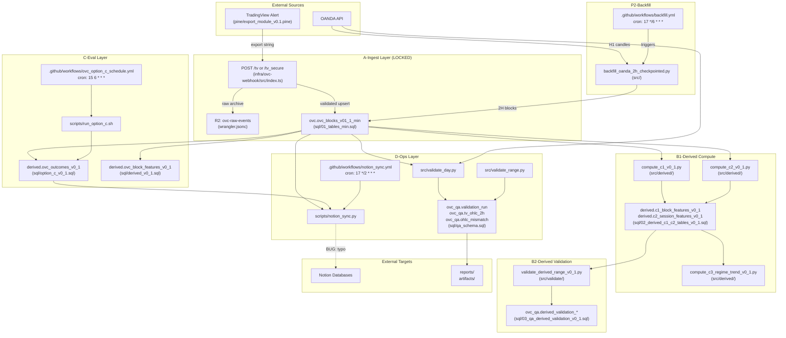

# Pipeline Reality Map v0.1

> **Generated:** 2026-01-19  
> **Audit Type:** Deterministic, evidence-based  
> **Methodology:** File inspection, test execution, config analysis (no external API calls)

---

## A) Executive Table

| Pipeline ID | Status | Trigger Type | Entry Point(s) | Dependencies | Proof |
|-------------|--------|--------------|----------------|--------------|-------|
| **A-Ingest** | PARTIAL | HTTP webhook | `infra/ovc-webhook/src/index.ts` | Neon (DATABASE_URL), R2 (RAW_EVENTS), OVC_TOKEN | Worker compiles (tsc); tests FAIL; deployment status UNKNOWN |
| **P2-Backfill** | LIVE | GitHub Actions schedule + manual | `src/backfill_oanda_2h_checkpointed.py`, `.github/workflows/backfill.yml` | NEON_DSN, OANDA_API_TOKEN, OANDA_ENV | Scheduled cron `17 */6 * * *`; script functional |
| **P2-BackfillValidate** | DORMANT | GitHub Actions manual | `.github/workflows/backfill_then_validate.yml` | NEON_DSN, OANDA_API_TOKEN | No schedule; workflow_dispatch only |
| **B1-DerivedC1** | LIVE | Called by workflows | `src/derived/compute_c1_v0_1.py` | NEON_DSN | Tests pass (24 tests); used in backfill_then_validate |
| **B1-DerivedC2** | LIVE | Called by workflows | `src/derived/compute_c2_v0_1.py` | NEON_DSN | Tests pass; used in backfill_then_validate |
| **B1-DerivedC3** | PARTIAL | CLI only | `src/derived/compute_c3_regime_trend_v0_1.py` | NEON_DSN, ovc_cfg.threshold_packs | Tests pass (19 tests); no workflow integration |
| **B2-DerivedValidation** | LIVE | Called by workflows | `src/validate/validate_derived_range_v0_1.py` | NEON_DSN, derived.* tables | Tests pass (50 tests) |
| **C-Eval** | PARTIAL | GitHub Actions schedule + manual | `scripts/run_option_c.sh`, `.github/workflows/ovc_option_c_schedule.yml` | DATABASE_URL, derived.* views | Scheduled cron `15 6 * * *`; no run artifacts in repo |
| **D-NotionSync** | PARTIAL | GitHub Actions schedule + manual | `scripts/notion_sync.py`, `.github/workflows/notion_sync.yml` | DATABASE_URL, NOTION_TOKEN, NOTION_*_DB_ID | Scheduled cron `17 */2 * * *`; **BUG: typo NOTIOM_TOKEN** |
| **D-ValidationHarness** | LIVE | CLI / workflow | `src/validate_day.py`, `src/validate_range.py` | NEON_DSN, ovc_qa.* | Tests pass; used in backfill_then_validate |
| **CI-WorkerTests** | PARTIAL | Local (npm test) | `infra/ovc-webhook/test/index.spec.ts` | None | 2 tests FAIL (missing exports) |
| **CI-PythonTests** | LIVE | Local (pytest) | `tests/*.py` | None (some skip without DB) | 134 passed, 1 skipped |

### Status Legend
- **LIVE**: Scheduled/deployed AND code functional
- **PARTIAL**: Code exists but has issues OR deployment/schedule unverifiable
- **DORMANT**: Code exists but no active trigger (manual only with no evidence of use)
- **UNKNOWN**: Cannot determine from repo evidence alone

---

## B) Wiring Graph (Current State)

---

## C) Gap Graph (Missing/Broken)

```mermaid
flowchart TD
    subgraph "BROKEN - Worker Tests"
        TEST_SPEC["infra/ovc-webhook/test/index.spec.ts"]
        INDEX_TS["infra/ovc-webhook/src/index.ts"]
        MISSING_EXPORT["MISSING: export parseExport<br/>MISSING: export msToTimestamptzStart2H"]
    end

    subgraph "BROKEN - Notion Sync"
        NOTION_PY["scripts/notion_sync.py:47"]
        TYPO["token = os.environ.get('NOTIOM_TOKEN')"]
        FIX["SHOULD BE: 'NOTION_TOKEN'"]
    end

    subgraph "UNKNOWN - Worker Deployment"
        WRANGLER_CFG["wrangler.jsonc"]
        DEPLOY_STATUS["Deployment Status: UNKNOWN<br/>(no wrangler whoami / deploy log in repo)"]
        SECRETS_STATUS["Secrets Status: UNKNOWN<br/>(OVC_TOKEN, DATABASE_URL)"]
    end

    subgraph "DORMANT - Workflows"
        GH_FULL_INGEST[".github/workflows/ovc_full_ingest.yml"]
        GH_BACKFILL_VAL[".github/workflows/backfill_then_validate.yml"]
        NO_SCHEDULE["NO SCHEDULE<br/>workflow_dispatch only"]
    end

    subgraph "PARTIAL - C3 Integration"
        C3_SCRIPT["src/derived/compute_c3_regime_trend_v0_1.py"]
        NO_WORKFLOW["NOT INTEGRATED<br/>No workflow calls C3"]
        THRESH_REG["ovc_cfg.threshold_packs<br/>Requires manual setup"]
    end

    subgraph "MISSING - Run Artifacts"
        OPT_C_ARTIFACTS["Option C Artifacts"]
        REPORTS_DIR["reports/"]
        NO_EVIDENCE["NO EVIDENCE of recent runs<br/>in repo (GitHub API required)"]
    end

    TEST_SPEC -->|"imports"| MISSING_EXPORT
    MISSING_EXPORT -->|"should add to"| INDEX_TS

    NOTION_PY --> TYPO
    TYPO -->|"fix to"| FIX

    WRANGLER_CFG --> DEPLOY_STATUS
    WRANGLER_CFG --> SECRETS_STATUS

    GH_FULL_INGEST --> NO_SCHEDULE
    GH_BACKFILL_VAL --> NO_SCHEDULE

    C3_SCRIPT --> NO_WORKFLOW
    C3_SCRIPT --> THRESH_REG

    OPT_C_ARTIFACTS --> REPORTS_DIR
    REPORTS_DIR --> NO_EVIDENCE

    classDef broken fill:#f99,stroke:#c00
    classDef unknown fill:#ff9,stroke:#c90
    classDef dormant fill:#9cf,stroke:#06c
    classDef missing fill:#f9f,stroke:#909

    class TEST_SPEC,NOTION_PY,TYPO broken
    class DEPLOY_STATUS,SECRETS_STATUS,NO_EVIDENCE unknown
    class GH_FULL_INGEST,GH_BACKFILL_VAL dormant
    class NO_WORKFLOW,THRESH_REG missing
```

### Gap Details

| Gap ID | Type | Current State | Expected State | Evidence |
|--------|------|---------------|----------------|----------|
| G1 | BROKEN | Worker tests fail with "not a function" | Tests should pass | `npm test` output; index.spec.ts:3 imports non-exported functions |
| G2 | BROKEN | Notion sync has typo `NOTIOM_TOKEN` | Should be `NOTION_TOKEN` | notion_sync.py:47 |
| G3 | UNKNOWN | Worker deployment status | Should have deployment evidence | No wrangler deploy logs in repo |
| G4 | UNKNOWN | Worker secrets (OVC_TOKEN, DATABASE_URL) | Should be set in Cloudflare | No verification possible without API access |
| G5 | DORMANT | `backfill_then_validate.yml` manual only | Could be scheduled for regression | workflow_dispatch without schedule |
| G6 | DORMANT | `ovc_full_ingest.yml` manual only | N/A (stub) | workflow_dispatch without schedule |
| G7 | PARTIAL | C3 not in any workflow | Should be integrated post-C2 | compute_c3_regime_trend_v0_1.py exists but not called |
| G8 | UNKNOWN | Option C run artifacts | Should see recent runs | No artifacts in reports/ or artifacts/ |

---

## D) Evidence Index

### A-Ingest
| Path | Line(s) | Evidence |
|------|---------|----------|
| infra/ovc-webhook/src/index.ts | 1-696 | Full worker implementation with MIN validation |
| infra/ovc-webhook/wrangler.jsonc | 1-25 | R2 bucket binding, name "ovc-webhook" |
| infra/ovc-webhook/package.json | 6-12 | Scripts: deploy, dev, test |
| infra/ovc-webhook/test/index.spec.ts | 1-21 | Tests import non-exported functions (BUG) |

### P2-Backfill
| Path | Line(s) | Evidence |
|------|---------|----------|
| src/backfill_oanda_2h_checkpointed.py | 1-593 | OANDA → Neon backfill with checkpointing |
| .github/workflows/backfill.yml | 5-6 | `schedule: cron: "17 */6 * * *"` |
| .github/workflows/backfill.yml | 4 | `workflow_dispatch: {}` |
| .env.example | 1-10 | NEON_DSN, OANDA_API_TOKEN documented |

### B1-DerivedCompute
| Path | Line(s) | Evidence |
|------|---------|----------|
| src/derived/compute_c1_v0_1.py | - | C1 block physics computation |
| src/derived/compute_c2_v0_1.py | - | C2 session/window features |
| src/derived/compute_c3_regime_trend_v0_1.py | - | C3 regime/trend classification |
| tests/test_derived_features.py | - | 24 tests (all pass) |
| tests/test_c3_regime_trend.py | - | 20 tests (19 pass, 1 skip) |
| .github/workflows/backfill_then_validate.yml | 119-136 | Steps 3-4 call compute_c1, compute_c2 |

### B2-DerivedValidation
| Path | Line(s) | Evidence |
|------|---------|----------|
| src/validate/validate_derived_range_v0_1.py | 1-200+ | Derived feature validation |
| tests/test_validate_derived.py | - | 50 tests (all pass) |
| sql/03_qa_derived_validation_v0_1.sql | - | QA tables for derived validation |
| .github/workflows/backfill_then_validate.yml | 138-148 | Step 5 calls validate_derived_range |

### C-Eval
| Path | Line(s) | Evidence |
|------|---------|----------|
| sql/option_c_v0_1.sql | 1-323 | derived.ovc_outcomes_v0_1 view |
| sql/derived_v0_1.sql | 1-177 | derived.ovc_block_features_v0_1 view |
| scripts/run_option_c.sh | 1-178 | Option C runner script |
| .github/workflows/ovc_option_c_schedule.yml | 4-5 | `schedule: cron: "15 6 * * *"` |

### D-NotionSync
| Path | Line(s) | Evidence |
|------|---------|----------|
| scripts/notion_sync.py | 1-318 | Notion API sync implementation |
| scripts/notion_sync.py | 47 | **BUG: `NOTIOM_TOKEN` typo** |
| .github/workflows/notion_sync.yml | 5-6 | `schedule: cron: "17 */2 * * *"` |
| .github/workflows/notion_sync.yml | 20-26 | Secrets: DATABASE_URL, NOTION_TOKEN, etc. |

### D-ValidationHarness
| Path | Line(s) | Evidence |
|------|---------|----------|
| src/validate_day.py | 1-386 | Single-day validation harness |
| src/validate_range.py | - | Multi-day validation |
| sql/qa_schema.sql | 1-54 | ovc_qa.* tables |

### Contracts
| Path | Line(s) | Evidence |
|------|---------|----------|
| contracts/export_contract_v0.1.1_min.json | 1-75 | IMMUTABLE MIN contract (52 fields) |
| tests/test_contract_equivalence.py | - | Contract validation tests |
| tests/test_min_contract_validation.py | - | MIN validation tests |

### Schemas
| Path | Evidence |
|------|----------|
| sql/00_schema.sql | Base schemas |
| sql/01_tables_min.sql | ovc.ovc_blocks_v01_1_min (LOCKED) |
| sql/02_derived_c1_c2_tables_v0_1.sql | derived.c1_*, derived.c2_* |
| sql/02_tables_run_reports.sql | ovc.ovc_run_reports_v01 |
| sql/04_threshold_registry_v0_1.sql | ovc_cfg.threshold_packs |
| sql/05_c3_regime_trend_v0_1.sql | derived.c3_* |

---

## Recommendations

### Critical Fixes
1. **Fix Worker Tests:** Export `parseExport` and `msToTimestamptzStart2H` from `index.ts`, or rewrite tests to use internal testing
2. **Fix Notion Sync Typo:** Change `NOTIOM_TOKEN` to `NOTION_TOKEN` at line 47

### Verification Needed (Requires External Access)
1. Verify Cloudflare Worker deployment status via `wrangler whoami` / Cloudflare dashboard
2. Verify GitHub Actions run history for scheduled workflows
3. Verify Neon database has all required tables via direct connection

### Enhancements
1. Add C3 compute step to `backfill_then_validate.yml` workflow
2. Add run artifact generation to Option C workflow
3. Consider scheduling `backfill_then_validate.yml` for weekly regression

---

*End of Pipeline Reality Map v0.1*
